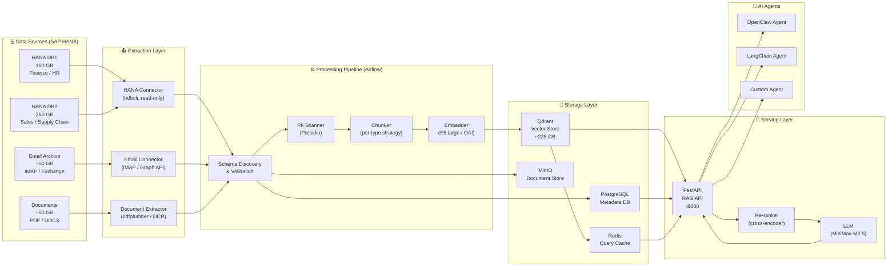
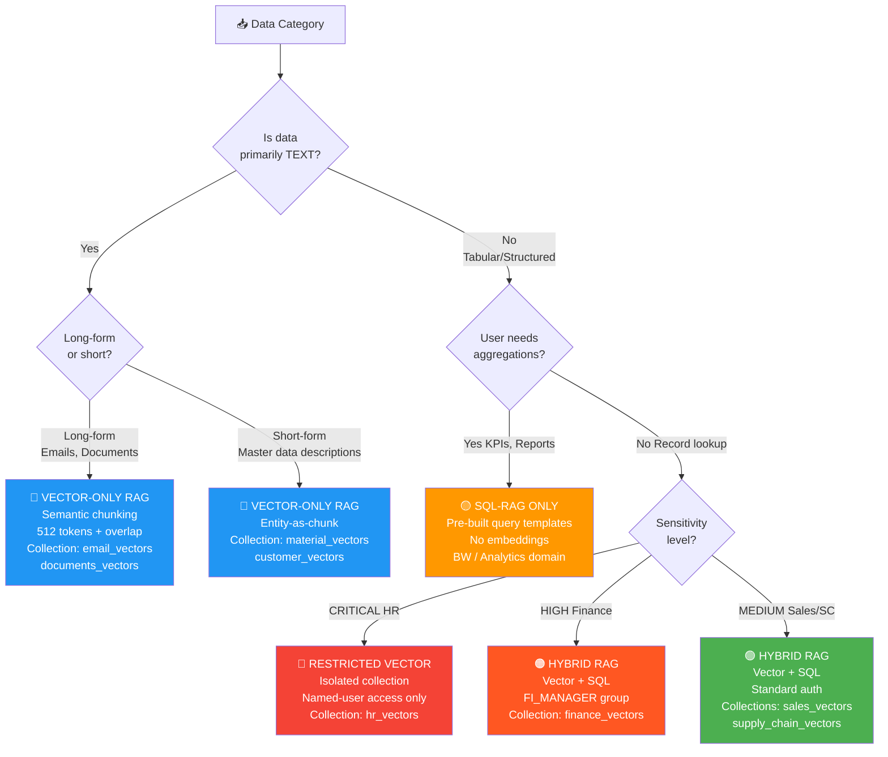
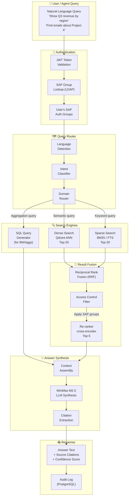
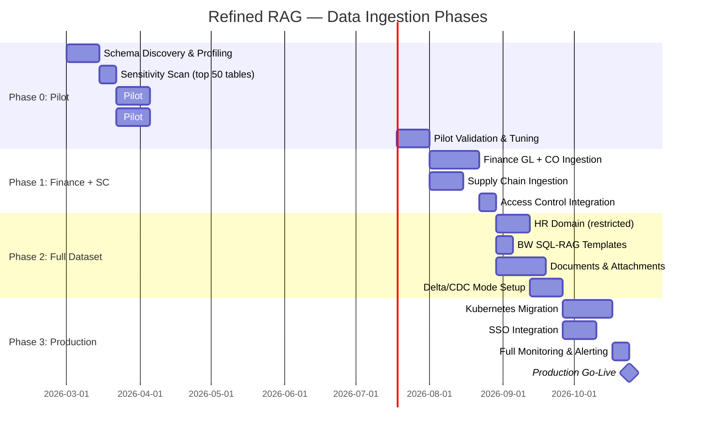
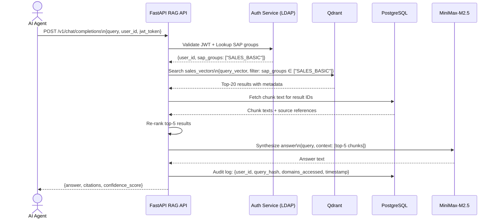

# Architecture Diagrams: Refined SAP HANA RAG System

**Version:** 1.0
**Date:** 2026-02-24
**Status:** Draft
**Author:** Claude Code via OpenClaw
**Note:** Diagrams rendered as Mermaid (GitHub-compatible) + ASCII art for plain-text viewing.
**Miro:** Miro board creation pending Miro MCP configuration.

---

## Diagram 1: Data Architecture — Sources → Processing → Storage



---

## Diagram 2: RAG Approach by Data Type (Decision Flow)



---

## Diagram 3: Hybrid System Architecture (Components & Flow)



---

## Diagram 4: Data-to-RAG Category Mapping (Visual Summary)

```mermaid
quadrantChart
    title Data-to-RAG Approach by Volume & Sensitivity
    x-axis Low Volume --> High Volume
    y-axis Low Sensitivity --> High Sensitivity
    quadrant-1 Hybrid RAG (Careful)
    quadrant-2 SQL-RAG / Restricted
    quadrant-3 Vector RAG (Fast pilot)
    quadrant-4 Hybrid RAG (Priority)
    HR Payroll: [0.15, 0.95]
    Finance GL: [0.75, 0.8]
    Email Archive: [0.6, 0.45]
    Sales Orders: [0.55, 0.4]
    Supply Chain: [0.5, 0.35]
    BW Analytics: [0.7, 0.3]
    Material Master: [0.3, 0.15]
    Documents: [0.6, 0.35]
    HR Org: [0.2, 0.65]
    Customers: [0.25, 0.3]
```

---

## Diagram 5: Ingestion Pipeline Timeline (Phases)



---

## Diagram 6: Security & Data Flow



---

## ASCII Art: System Overview (Plain Text)

For environments where Mermaid is not rendered:

```
┌─────────────────────────────────────────────────────────────────────────────┐
│                   REFINED SAP HANA → RAG SYSTEM OVERVIEW                    │
└─────────────────────────────────────────────────────────────────────────────┘

┌─────────────────────────────┐     ┌──────────────────────────────────────────┐
│      DATA SOURCES           │     │            PROCESSING PIPELINE            │
│                             │     │                                            │
│  ┌─────────────────────┐    │     │  ┌─────────┐  ┌────────┐  ┌──────────┐  │
│  │   SAP HANA DB1      │    │     │  │ Extract │  │  PII   │  │  Chunk   │  │
│  │   160 GB            │────┼────►│  │  Layer  │─►│  Scan  │─►│ Strategy │  │
│  │  Finance/HR         │    │     │  │ (hdbcli)│  │Presidio│  │ per-type │  │
│  └─────────────────────┘    │     │  └─────────┘  └────────┘  └────┬─────┘  │
│                             │     │                                 │        │
│  ┌─────────────────────┐    │     │                            ┌────▼─────┐  │
│  │   SAP HANA DB2      │    │     │                            │  Embed   │  │
│  │   260 GB            │────┼────►│                            │ E5-large │  │
│  │  Sales/Supply       │    │     │                            │or OAI API│  │
│  └─────────────────────┘    │     │                            └────┬─────┘  │
│                             │     └─────────────────────────────────┼────────┘
│  ┌─────────────────────┐    │                                        │
│  │   Email Archive     │    │     ┌──────────────────────────────────┼────────┐
│  │   ~50 GB            │────┼────►│           STORAGE LAYER          │        │
│  │  IMAP/Exchange      │    │     │                                  ▼        │
│  └─────────────────────┘    │     │  ┌──────────────────────────────────┐    │
│                             │     │  │         Qdrant Vector Store       │    │
│  ┌─────────────────────┐    │     │  │  finance_vectors  sales_vectors   │    │
│  │   Documents         │    │     │  │  hr_vectors       email_vectors   │    │
│  │   ~50 GB            │────┼────►│  │  ~28.5M vectors   ~228 GB        │    │
│  │  PDF/DOCX           │    │     │  └──────────────────┬───────────────┘    │
│  └─────────────────────┘    │     │                     │                    │
└─────────────────────────────┘     │  ┌──────────┐  ┌───┴────┐  ┌────────┐   │
                                    │  │PostgreSQL│  │ Redis  │  │ MinIO  │   │
                                    │  │Metadata  │  │ Cache  │  │  Docs  │   │
                                    │  └────┬─────┘  └───┬────┘  └────────┘   │
                                    └───────┼────────────┼────────────────────┘
                                            │            │
                                    ┌───────▼────────────▼────────────────────┐
                                    │              SERVING LAYER               │
                                    │                                          │
                                    │  ┌─────────────────────────────────┐    │
                                    │  │     FastAPI RAG API :8000        │    │
                                    │  │  POST /v1/search                 │    │
                                    │  │  POST /v1/chat/completions       │    │
                                    │  └──────────────┬──────────────────┘    │
                                    │                 │                        │
                                    │  ┌──────────────▼──────────────────┐    │
                                    │  │  Re-ranker → LLM Synthesis      │    │
                                    │  │  (cross-encoder + MiniMax-M2.5) │    │
                                    │  └──────────────┬──────────────────┘    │
                                    └─────────────────┼───────────────────────┘
                                                      │
                                    ┌─────────────────▼───────────────────────┐
                                    │              AI AGENTS                   │
                                    │  OpenClaw │ LangChain │ Custom Agents    │
                                    └─────────────────────────────────────────┘
```

---

## Notes on Miro Visualization

These diagrams are prepared as Mermaid-compatible markdown. Once Miro MCP is configured, the following boards should be created:

| Board Name                           | Source Diagram | Priority |
|--------------------------------------|----------------|----------|
| Refined RAG — Data Architecture      | Diagram 1      | HIGH     |
| Refined RAG — Decision Flow          | Diagram 2      | HIGH     |
| Refined RAG — System Architecture    | Diagram 3      | HIGH     |
| Refined RAG — Data Mapping Matrix    | Diagram 4      | MEDIUM   |
| Refined RAG — Ingestion Timeline     | Diagram 5      | MEDIUM   |
| Refined RAG — Security Flow          | Diagram 6      | HIGH     |

To create Miro boards when MCP is available:
```bash
# Example: create board via Miro MCP (once configured in ~/.claude/settings.json)
# miro create_board --name "Refined RAG Architecture" --team_id <team_id>
# miro create_shape --type flowchart --content <diagram_content>
```
