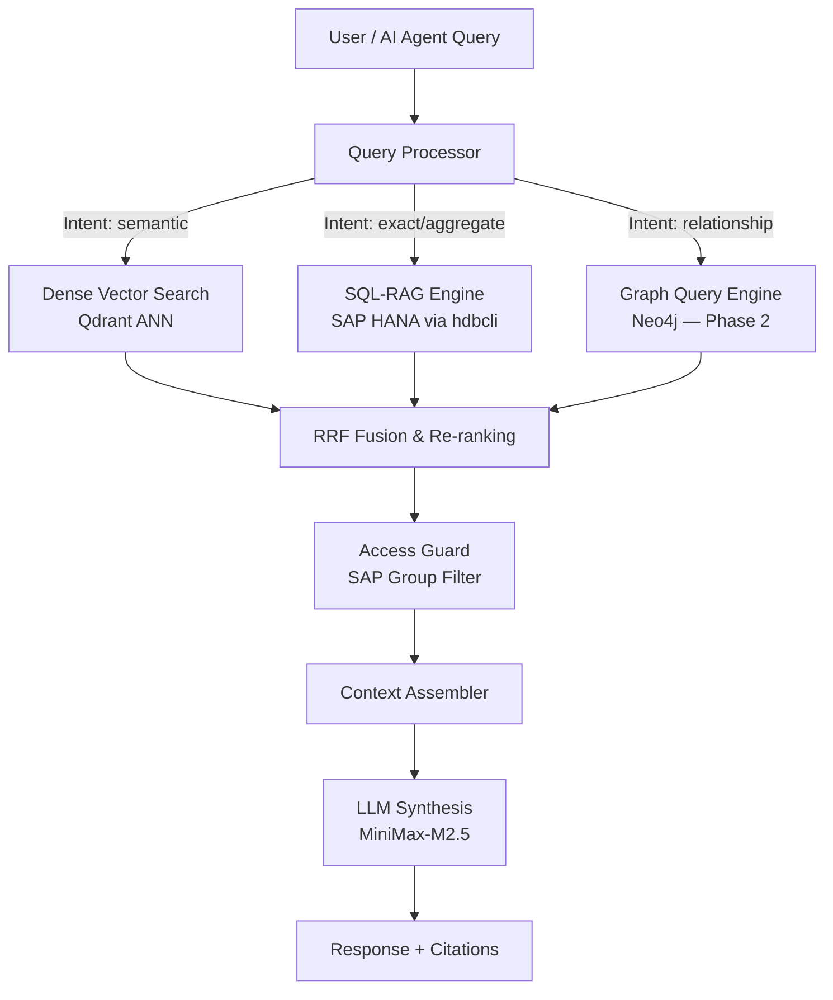
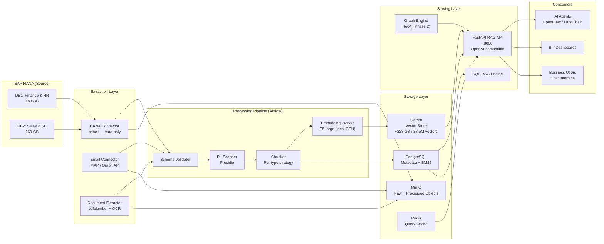
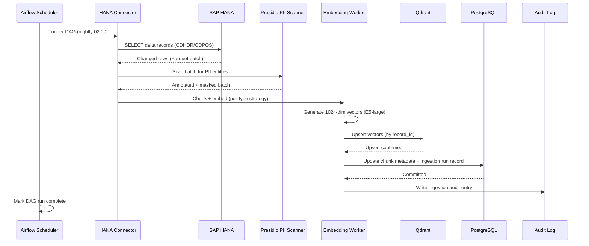
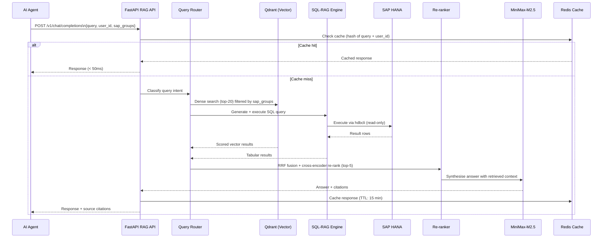
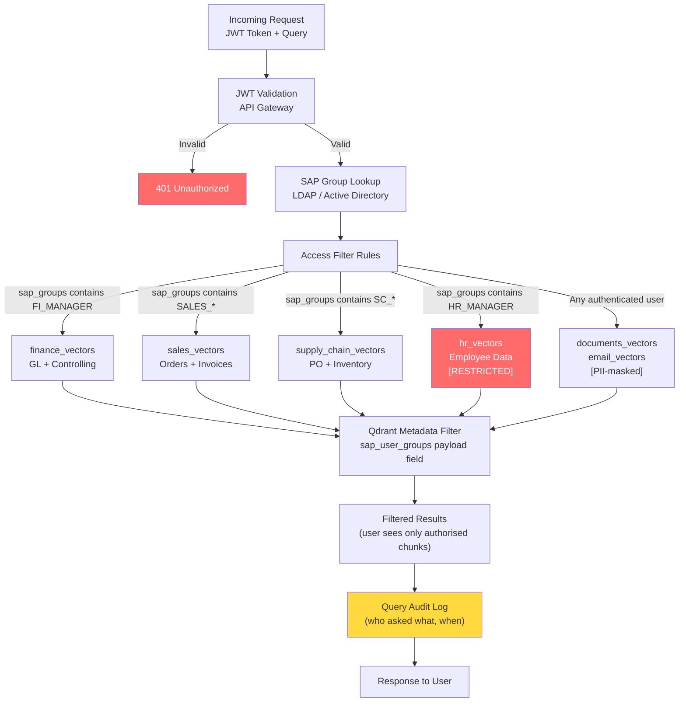

# Refined AI Intelligence Platform
## Comprehensive Solution Proposal — SAP HANA RAG System

**Prepared for:** Refined
**Version:** 1.0
**Date:** 2026-02-24
**Classification:** Confidential

---

## Executive Summary

Refined holds 420 GB of operational data spread across two SAP HANA databases — 160 GB of Finance and HR data and 260 GB of Sales and Supply Chain data. This data is currently accessible only through traditional SAP interfaces: fixed reports, transaction codes, and manual queries that require deep SAP expertise to navigate.

This proposal outlines an **AI Intelligence Platform** that makes every piece of this data searchable through natural language. Business users and AI agents will be able to ask questions like *"Which customers have outstanding invoices over 90 days and also had delivery complaints this quarter?"* and receive accurate, sourced answers in seconds — without needing to know SAP transaction codes, table names, or SQL.

The platform uses a **hybrid retrieval architecture**: structured SAP data is searched via a combination of semantic vector search and SQL execution, unstructured data (emails, documents) is searched semantically, and complex cross-domain relationship queries optionally traverse a graph layer. All three paths converge at a single API that AI agents consume using a standard OpenAI-compatible interface.

**Estimated scope at full production:**
- ~28.5 million vectors across 6 domain collections
- ~228 GB vector index storage
- Full 420 GB source data covered
- Response latency target: < 2 seconds for 95th percentile queries
- Phased delivery from pilot in 8 weeks to full production in 28 weeks

---

## 1. The Challenge — Enterprise Data That Cannot Talk

### 1.1 What Makes SAP Data Hard

SAP HANA stores business-critical data in a highly normalized relational model. A single sales transaction can span twelve or more tables. A vendor risk assessment requires joining procurement, inventory, and financial tables that span both databases. This data model was designed for transactional integrity — not for natural-language search.

Three fundamental problems prevent modern AI from working with SAP data directly:

**Problem 1: Schema opacity.** SAP uses technical table and field names (`VBAK`, `BELNR`, `DMBTR`) that have no meaning outside the system. An AI model cannot guess that `BKPF` + `BSEG` together represent an accounting document.

**Problem 2: Data heterogeneity.** The 420 GB contains at least six fundamentally different types of data — transactional records, master data entities, pre-aggregated analytics, email archives, scanned documents, and HR profiles — each requiring a different retrieval strategy.

**Problem 3: Access complexity.** Different users are authorised to see different subsets of data. Financial P&L data should not be visible to a sales rep's AI queries. HR compensation data must never appear in any AI response except to authorised individuals. A naive embedding approach would surface restricted data.

### 1.2 What Business Users Actually Need

Through analysis of typical SAP usage patterns, user queries fall into four categories:

| Query Type | Example | Frequency |
|---|---|---|
| Entity lookup | "Find customer Acme Corp's account details" | High |
| Aggregation/KPI | "What is Q3 revenue by sales region?" | High |
| Cross-domain relationship | "Which open orders are at risk due to supplier delays?" | Medium |
| Contextual/narrative | "What did management decide about the Phoenix project?" | Medium |

No single retrieval technology handles all four well. The architecture must route queries to the right retrieval method automatically.

---

## 2. Data Landscape Analysis

### 2.1 Six Categories of SAP Data

After analysis of Refined's known data footprint, the 420 GB breaks into six distinct categories with very different retrieval characteristics:

**Category 1 — Transactional Records (~200 GB)**
Tables: BKPF/BSEG (Finance GL), VBAK/VBAP/VBRK/VBRP (Sales), EKKO/EKPO (Procurement)
Nature: Dense rows of structured facts with business keys and amounts.
Best retrieval: Hybrid — semantic search finds the right documents; SQL executes exact aggregations.
Challenge: Volume is large; chunking must preserve the business context of header + line items together.

**Category 2 — Master Data Entities (~15 GB)**
Tables: KNA1 (Customers), LFA1 (Vendors), MARA/MAKT (Materials), HRP1000 (Org)
Nature: Rich descriptive entities with codes, descriptions, and classifications.
Best retrieval: Vector search — entities are naturally document-like and benefit from semantic similarity.
Challenge: Must link back to transactional data at query time to be useful.

**Category 3 — Pre-Aggregated Analytics (~60 GB)**
Tables: BW/4HANA InfoCubes, DSOs, CompositeProviders
Nature: Aggregated KPI data already structured for reporting.
Best retrieval: SQL-RAG only — no value in embedding pre-aggregated numbers; generate SQL and execute.
Challenge: Query generation requires understanding the BW data model.

**Category 4 — HR & People Data (~15 GB)**
Tables: PA0000–PA9999 (personnel data), PA0008 (payroll)
Nature: Sensitive personal and compensation data.
Best retrieval: Vector search in isolated, strictly access-controlled collection.
Challenge: Salary, personal data, and bank details must never be embedded. Rigorous PII masking and access gating are non-negotiable.

**Category 5 — Email Archive (~50 GB)**
Source: SAP HANA tables (SOFFPHIO) or Exchange/IMAP — to confirm with Refined IT.
Nature: Unstructured narrative text with thread context and relationships between people.
Best retrieval: Dense vector search with semantic chunking.
Challenge: Highest PII density of any category; sender/recipient names must be masked before embedding.

**Category 6 — Documents & Attachments (~50 GB)**
Tables: SOFFPHIO, SOFFCONT (SAP document store), or filesystem
Nature: PDFs, DOCX, presentations attached to SAP business processes.
Best retrieval: Dense vector search after OCR and text extraction.
Challenge: Scanned documents require OCR; document quality varies.

### 2.2 Cross-Domain Relationships (Graph Layer — Phase 2)

SAP data has deep graph-like relationships that neither SQL joins nor vector search handle elegantly. Consider the query: *"Which of our key customers are at delivery risk if Vendor A fails?"* Answering this requires traversing: Vendor A → their supplied Materials → active Purchase Orders → those Materials in open Sales Orders → those Sales Orders' Customers.

This multi-hop traversal is where a graph database adds unique value. It is not required for the pilot but is recommended as a Phase 2 enhancement for supply chain risk and relationship analytics.

---

## 3. Retrieval Architecture Design

### 3.1 The Hybrid Retrieval Model

The system employs three retrieval pathways that operate in parallel and whose results are fused before being sent to the language model:

**Path 1 — Dense Vector Search:** Converts the user query to a 1024-dimensional embedding and searches Qdrant for the most semantically similar chunks. Captures meaning even when the user does not know exact terminology. A query about "unpaid supplier invoices" matches chunks containing "outstanding payables" and "vendor aging."

**Path 2 — SQL-RAG:** An LLM generates a SQL query from the natural-language question and executes it against SAP HANA. Returns precise aggregations and counts. Answers "What is our total outstanding payables balance?" exactly rather than approximately.

**Path 3 — Graph Query (Phase 2):** Executes a Cypher query against Neo4j to traverse business entity relationships. Returns relationship chains and dependency paths.

The three paths are merged using **Reciprocal Rank Fusion (RRF)**, which combines ranked lists without requiring score normalisation. After fusion, a cross-encoder re-ranker selects the top 5 most relevant passages, which are assembled into the LLM's context window.

### 3.2 Query Routing Logic

Query routing is handled by a lightweight classification layer running before retrieval:

| Signal | Routing Decision |
|---|---|
| Question contains aggregate words (total, average, count, how many) | SQL-RAG primary |
| Question contains relationship words (connected, linked, impact, risk, because of) | Graph primary (Phase 2) |
| Question is narrative/contextual (what did X say, find emails about, summarise) | Vector primary |
| Question contains SAP codes (SO number, material number, GL account) | SQL-RAG + Vector hybrid |
| No clear signal | Full hybrid — all three paths |

---

## 4. Technology Selection & Justification

### 4.1 Vector Store — Qdrant vs Milvus

Both Qdrant and Milvus are production-grade open-source vector databases capable of supporting the 28.5M vector scale required. The selection criteria for Refined's use case are: metadata filtering quality, operational simplicity, access control model, and self-hosted data residency.

| Criterion | Qdrant | Milvus |
|---|---|---|
| **Metadata filtering** | Excellent — per-payload indexed filters, no performance penalty | Good — but filtering at scale requires careful index configuration |
| **Operational complexity** | Low — single binary or cluster, Rust-based, minimal dependencies | High — requires etcd, MinIO, Pulsar/Kafka; significant ops overhead |
| **Access control model** | Per-collection + payload-level filters map directly to SAP roles | Per-collection only — payload filtering is application-layer |
| **Target scale** | Optimal 1M–100M vectors | Optimal 100M+ vectors |
| **Data residency** | Fully self-hosted | Fully self-hosted |
| **Production maturity** | Production-ready, strong community | Production-ready, strong community |
| **Best fit for Refined** | **Yes** — 28.5M vectors, complex access control | No — over-engineered for this scale |

**Decision: Qdrant.** At 28.5M vectors, Qdrant operates well within its optimal range. Its payload-level metadata filtering is the critical differentiator: Refined's access control model requires filtering vectors by `sap_user_groups` on every query, and Qdrant handles this natively and efficiently. Milvus would introduce significant operational overhead (etcd cluster, message queue, object store) without providing any capability advantage at this scale.

### 4.2 Graph Database — Neo4j vs NebulaGraph

The graph layer is a Phase 2 addition. If implemented, it stores SAP entity relationships (Customer–Order–Material–Vendor chains) for multi-hop traversal queries.

| Criterion | Neo4j | NebulaGraph |
|---|---|---|
| **Target scale** | Billions of nodes (Enterprise), suitable for Refined | Tens of billions — designed for internet-scale social graphs |
| **Query language** | Cypher — intuitive, widespread, excellent tooling | nGQL — less mature, smaller ecosystem |
| **Python integration** | Excellent — `neo4j` driver, LangChain native support | Good — official driver available |
| **Operational maturity** | Very mature (15+ years), excellent monitoring | Younger project, evolving ops story |
| **Licensing** | Community (limited) / Enterprise (cost) | Apache 2.0 — fully open |
| **Best fit for Refined** | **Yes** — excellent ecosystem, adequate scale | No — over-engineered; ecosystem cost outweighs savings |

**Decision: Neo4j.** Refined's SAP graph will contain tens of millions of nodes (customers, vendors, materials, orders) — well within Neo4j's comfortable operating range. Cypher's readability matters: the team maintaining the system should be able to write and debug queries. NebulaGraph is designed for billion-node social graphs and would be technically appropriate but operationally immature for an enterprise deployment. Note: Neo4j Community Edition is sufficient for the pilot; Enterprise Edition licensing should be evaluated at Phase 2 production sizing.

### 4.3 Supporting Technology Selections

| Component | Selected Technology | Rationale |
|---|---|---|
| Embedding model | `intfloat/multilingual-e5-large` (local) | Data residency; strong multilingual performance; 1024 dims |
| Orchestration | Apache Airflow | Mature, battle-tested for ETL; native retry logic; monitoring |
| API layer | FastAPI | Async, OpenAI-compatible schema, low latency |
| Object storage | MinIO | Self-hosted S3-compatible; staging area for Parquet extracts |
| Metadata DB | PostgreSQL 16 | Reliable, full-text search for BM25 sparse retrieval path |
| Cache | Redis | Sub-millisecond repeated query caching |
| PII masking | Microsoft Presidio | Production-grade NLP entity detection; extensible |
| LLM synthesis | MiniMax-M2.5 | Primary; Ollama local models as fallback |

---

## 5. System Architecture

### 5.1 End-to-End Data Flow

### 5.2 Ingestion Pipeline Detail

### 5.3 Query Processing Flow

### 5.4 Security & Access Control Model

---

## 6. Data Categories & Retrieval Mapping

### 6.1 Complete Domain Mapping

| Domain | Source Tables | Volume | Retrieval Method | Sensitivity | Pilot Phase |
|---|---|---|---|---|---|
| Finance — GL | BKPF, BSEG | ~80 GB | Hybrid | HIGH | No |
| Finance — Controlling | COEP, COSS | ~20 GB | Hybrid | HIGH | No |
| Sales Orders | VBAK, VBAP | ~40 GB | Hybrid | MEDIUM | **Phase 0** |
| Invoices / Billing | VBRK, VBRP | ~25 GB | Hybrid | MEDIUM | **Phase 0** |
| Customers | KNA1, KNB1 | ~5 GB | Vector | MEDIUM | No |
| Supply Chain / PO | EKKO, EKPO | ~30 GB | Hybrid | MEDIUM | No |
| Inventory | MARD, MSEG | ~25 GB | Hybrid | LOW | No |
| Material Master | MARA, MAKT | ~10 GB | Vector | LOW | No |
| HR — Employees | PA0000–PA0002 | ~15 GB | Vector (restricted) | CRITICAL | No |
| HR Org Structure | HRP1000–HRP1001 | ~5 GB | Vector | HIGH | No |
| BW Analytics | InfoCubes, DSOs | ~60 GB | SQL-RAG only | MEDIUM | No |
| Email Archive | SOFFPHIO / IMAP | ~50 GB | Vector | VARIABLE | **Phase 0** |
| Documents / Attachments | SOFFCONT, filesystem | ~50 GB | Vector | VARIABLE | No |
| **Total** | | **~415 GB** | | | |

### 6.2 Chunking Strategy by Data Type

The way data is divided into chunks fundamentally affects retrieval quality. The wrong chunking strategy is a common cause of poor RAG performance with enterprise data.

| Data Type | Strategy | Chunk Size | Reasoning |
|---|---|---|---|
| Financial transactions | Row-as-chunk | 1 record = 1 chunk | Each GL line item is an atomic fact; splitting loses context |
| Sales orders | Header + all line items | ~500 tokens | Order meaning requires header context; items are meaningless alone |
| HR profiles | Entity-as-chunk | ~800 tokens | A person's profile is a unit; fragmenting loses coherence |
| Emails | Recursive character splitter | 512 tokens / 64 overlap | Emails can be long; overlap prevents context loss at boundaries |
| PDF documents | Semantic paragraph splitter | 512 tokens / 64 overlap | Respects natural paragraph breaks |
| Master data (customers, materials) | Entity-as-chunk | ~300 tokens | Each entity is naturally document-like |

### 6.3 Estimated Vector Index at Full Scale

| Domain | Approach | Estimated Vectors | Index Storage |
|---|---|---|---|
| Finance — GL | Hybrid | 8,000,000 | ~32 GB |
| Finance — Controlling | Hybrid | 2,000,000 | ~8 GB |
| Sales + Billing | Hybrid | 5,000,000 | ~20 GB |
| Customers | Vector | 200,000 | ~0.8 GB |
| Supply Chain | Hybrid | 6,000,000 | ~24 GB |
| Inventory | Hybrid | 3,000,000 | ~12 GB |
| Material Master | Vector | 500,000 | ~2 GB |
| HR (restricted) | Vector | 300,000 | ~1.2 GB |
| BW Analytics | SQL-RAG | 0 | 0 GB |
| Email Archive | Vector | 2,000,000 | ~8 GB |
| Documents | Vector | 1,500,000 | ~6 GB |
| **TOTAL** | | **~28.5M** | **~114 GB index / ~228 GB Qdrant total** |

> Vector storage estimate: 1024-dimensional float32 vectors at ~4 KB each + HNSW graph overhead (~4 KB) = ~8 KB per vector in Qdrant. At 28.5M vectors: ~228 GB Qdrant storage.

---

## 7. PII & Compliance Framework

### 7.1 PII Classification by SAP Domain

Before any data is embedded, it passes through Microsoft Presidio — a production-grade PII detection and masking framework. The following rules apply universally:

| PII Type | Detection Method | Action | Example |
|---|---|---|---|
| Person names | NLP entity recognition | Replace with `[PERSON]` | "John Smith" → `[PERSON]` |
| Email addresses | Regex + NLP | Hash with prefix: `[EMAIL:abc12]` | Prevents correlation without exposing address |
| Phone numbers | Regex (multi-country) | Replace with `[PHONE]` | |
| IBAN / bank accounts | Regex | Replace with `[FINANCIAL_ACCOUNT]` | |
| Salary / compensation | Field-level rule (PA0008) | **Field never embedded** | Payroll data excluded entirely |
| SAP employee IDs (PERNR) | Field-level rule | Keep as pseudonym reference key | Non-PII by itself; linked fields masked |

### 7.2 GDPR Erasure Support

When a data erasure request is received (GDPR Article 17), the system executes:
1. Identify all chunks containing the individual's PERNR reference key
2. Delete those chunks from Qdrant by ID
3. Remove corresponding metadata rows from PostgreSQL
4. Log the erasure event with timestamp and legal basis

This operation can be executed on demand without a full re-index of the dataset.

### 7.3 Data Residency

All processing occurs on Refined's on-premise infrastructure. No SAP data leaves the perimeter:
- Embedding model runs locally (E5-large on GPU)
- Qdrant vector store is self-hosted
- MiniMax-M2.5 is accessed via Refined's authorised endpoint; SAP data is only sent as part of the synthesis prompt after retrieval (not in bulk)

---

## 8. Implementation Roadmap

### Phase 0 — Pilot (Weeks 1–8)

**Goal:** Validate the architecture with real data before committing to full scale.

**Scope:**
- Sales Orders + Invoices: 2024 data only (~5 GB, ~250K vectors)
- Email Archive: 2024 sample (~2 GB, ~150K vectors)
- 5 pilot users from Sales and Finance teams
- Deploy on single server via Docker Compose

**Success criteria:**
- Precision@5 > 80% on pre-defined test query set
- Average query latency < 3 seconds
- Zero PII leakage in any response (verified by human review)
- User satisfaction score ≥ 4/5 from pilot users

**Pilot test queries:**
- "Show me all orders from Acme Corp in Q3 2024"
- "Find invoices over EUR 100,000 that are more than 30 days overdue"
- "What did management say about the Phoenix project budget?"
- "Find emails discussing delivery issues in July"
- "Which sales rep has the highest revenue this year?"

### Phase 1 — Structured Data Expansion (Weeks 9–16)

**Goal:** Add Finance and Supply Chain domains; introduce role-based access control.

**Scope:**
- Finance GL + Controlling: full dataset (~100 GB)
- Supply Chain PO + Inventory: full dataset (~55 GB)
- Activate access control tier enforcement
- Load test with 20 concurrent users
- Deploy on dedicated server with GPU for embedding acceleration

### Phase 2 — Full Coverage + Graph Layer (Weeks 17–24)

**Goal:** Complete the data coverage; add graph traversal for relationship queries.

**Scope:**
- All remaining domains: HR, Customers, Material Master, Documents
- Deploy Neo4j with SAP entity relationship graph
- Integrate graph traversal into query router
- Migrate to Kubernetes for production resilience

### Phase 3 — Production Hardening (Weeks 25–28)

**Goal:** Enterprise-grade reliability and operations.

**Scope:**
- Kubernetes cluster deployment (3-node Qdrant cluster, HA PostgreSQL)
- SSO/Active Directory integration for JWT authentication
- Full audit logging with SIEM integration
- SLA monitoring: alerting on latency > 5s, error rate > 0.1%
- Runbook documentation for operations team

---

## 9. Infrastructure Requirements

### 9.1 Pilot Environment (Docker Compose — Single Server)

| Component | CPU | RAM | Storage |
|---|---|---|---|
| Qdrant | 4 vCPU | 16 GB | 100 GB NVMe SSD |
| PostgreSQL 16 | 2 vCPU | 4 GB | 50 GB SSD |
| Apache Airflow | 2 vCPU | 4 GB | 20 GB |
| FastAPI (×2 replicas) | 2 vCPU | 2 GB | — |
| MinIO | 2 vCPU | 2 GB | 200 GB |
| Redis | 1 vCPU | 2 GB | 10 GB |
| Embedding Worker | 4 vCPU + optional GPU | 8 GB | — |
| **Total** | **~17 vCPU** | **~38 GB** | **~380 GB** |

> GPU acceleration (NVIDIA T4 or equivalent) reduces embedding time from ~72 hours to ~4 hours for the pilot dataset. Strongly recommended.

### 9.2 Production Environment (Kubernetes)

| Component | Replicas | CPU / Replica | RAM / Replica | Notes |
|---|---|---|---|---|
| Qdrant | 3 | 8 vCPU | 32 GB | Distributed cluster, sharded collections |
| PostgreSQL (HA) | 1 primary + 1 replica | 4 vCPU | 16 GB | Streaming replication |
| FastAPI | 3–5 (auto-scale) | 2 vCPU | 4 GB | HPA on CPU and latency |
| Embedding Workers | 2–8 (auto-scale) | 4 vCPU + GPU | 16 GB | GPU node pool |
| Airflow Scheduler | 1 | 2 vCPU | 4 GB | |
| Airflow Workers | 4 | 2 vCPU | 4 GB | Celery executor |
| Neo4j (Phase 2) | 1 | 8 vCPU | 32 GB | Enterprise edition recommended |

---

## 10. Risk Assessment

| Risk | Likelihood | Impact | Mitigation |
|---|---|---|---|
| HANA extraction impacts production performance | MEDIUM | HIGH | Read-only service account; scheduled extraction during 02:00–05:00 maintenance window |
| PII leakage in embedded chunks | LOW | CRITICAL | Presidio scan before every embedding; human spot-check on 1% random sample; automated PII detection tests in CI |
| Vector store performance degradation at scale | MEDIUM | HIGH | HNSW parameter tuning (m=16, ef=128); horizontal scaling plan ready; load tests at each phase gate |
| Email source architecture unclear (SOFFPHIO vs IMAP) | HIGH | MEDIUM | Resolve with Refined IT in Week 1; two connectors in parallel development to de-risk |
| SAP schema changes break extractors | LOW | MEDIUM | Schema version fingerprinting; Airflow alerting on extraction errors; weekly schema diff check |
| GDPR erasure volume higher than expected | LOW | HIGH | Erasure pipeline automated; erasure SLA defined in contract (72h response) |
| Embedding model quality insufficient for SAP terminology | LOW | MEDIUM | Evaluate three models on 500-query sample set before committing; E5-large strong on multilingual enterprise text |
| Neo4j licensing cost at scale | MEDIUM | MEDIUM | Community Edition for pilot; evaluate Enterprise vs alternative (Apache AGE on PostgreSQL) at Phase 2 |

---

## 11. Open Questions Requiring Refined Input

Before full implementation begins, the following must be confirmed with Refined:

1. **Email architecture:** Does email live in SAP HANA (SOFFPHIO tables) or in Microsoft Exchange / Office 365? This determines which connector to build.
2. **SAP version:** Is this S/4HANA, ECC on HANA, BW/4HANA, or a combination? This affects available extraction APIs and change detection mechanisms.
3. **GDPR scope:** Which data subjects are covered? EU employees only, or also EU customers?
4. **Real-time vs batch:** Is nightly delta sync acceptable, or are there use cases requiring near-real-time (< 15 minute) data freshness?
5. **Customer account groups:** Are KNA1 customers B2B only, or is there a B2C segment requiring stronger PII masking?
6. **Data retention policy:** How many years of historical SAP data should be indexed? This directly affects vector count and storage sizing.

---

## 12. Next Steps

| Week | Action | Owner |
|---|---|---|
| 1 | Kick-off workshop — resolve open questions above | Refined IT + Solution Team |
| 1 | Provision pilot server; install Docker, NVIDIA drivers | Refined IT |
| 1–2 | SAP HANA read-only service account creation; network access | Refined Basis team |
| 2 | Email connector decision; configure IMAP or Graph API access | Refined IT |
| 2–3 | Deploy pilot infrastructure (Qdrant, Airflow, FastAPI, PostgreSQL) | Solution Team |
| 3–4 | First data extraction: Sales Orders 2024 | Solution Team |
| 4–5 | Embedding + indexing; integration tests | Solution Team |
| 5–6 | Email extraction, PII scan, embedding | Solution Team |
| 6–7 | Pilot API deployed; 5 pilot users onboarded | Refined + Solution Team |
| 8 | Pilot evaluation: precision, latency, user feedback | Both |
| 9 | Phase 0 review meeting — proceed / adjust before Phase 1 | Both |

---

## Appendix A — Architecture Decision Records

### ADR-001: Vector Store — Qdrant
Selected over Milvus (operational complexity too high), pgvector (performance ceiling), and Pinecone (cloud = data residency violation). Qdrant's payload-level filtering is the critical feature for Refined's multi-tenant access control model.

### ADR-002: Embedding Model — multilingual-e5-large (Local)
Selected over OpenAI text-embedding-3-large (requires data to leave on-premise). E5-large achieves strong multilingual results across the English/German/other language mix expected in Refined's SAP data and email archive.

### ADR-003: Hybrid Search — Dense + BM25 with RRF Fusion
SAP data contains many exact identifiers (part numbers, GL accounts, order numbers) that benefit from BM25 keyword matching. Pure semantic search would miss exact-match queries. RRF fusion is used because it does not require score normalisation across heterogeneous retrieval systems.

### ADR-004: Per-Type Chunking Strategy
Uniform chunking (e.g., 512 tokens everywhere) would split sales order headers from their line items, making the chunks meaningless in isolation. Per-type chunking preserves business context, at the cost of variable chunk sizes.

### ADR-005: Apache Airflow for Orchestration
Alternatives considered: Prefect (less mature at enterprise scale), custom cron scripts (no retry logic, no monitoring). Airflow provides robust DAG management, retry logic, alerting, and a UI for monitoring ingestion runs — essential for a production data pipeline team.

### ADR-006: LLM Synthesis — MiniMax-M2.5 (Primary) + Ollama (Fallback)
MiniMax-M2.5 provides strong reasoning quality for synthesis. Ollama with a local 7B–13B model (Mistral or LLaMA 3) provides a fully offline fallback in case of API unavailability, which is important for an on-premise architecture where internet access may be restricted.

---

*Document prepared by Claude Code via OpenClaw*
*Version 1.0 — 2026-02-24*
*Status: Ready for Customer Review*
