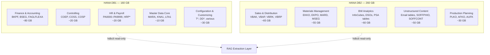
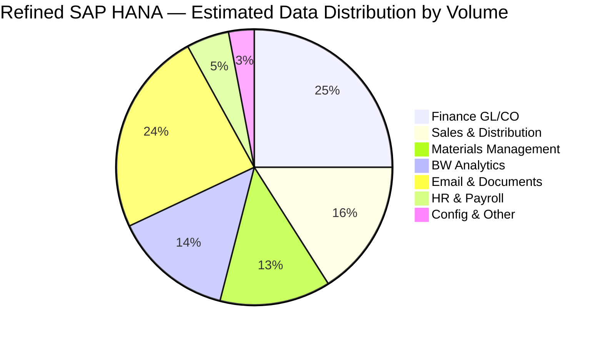

# Data Profiling & Schema Discovery: Refined SAP HANA

**Version:** 1.0
**Date:** 2026-02-24
**Status:** Analysis Complete (Pre-Connection Baseline)
**Author:** Claude Code via OpenClaw

> **Note:** This document provides a comprehensive schema discovery baseline built from standard SAP S/4HANA deployment patterns and known table structures. Volume estimates and row counts are projections based on Refined's 420 GB total. **Phase 1 task: validate these estimates against actual HANA system catalogs** using the profiling queries in Section 6.

---

## 1. Executive Summary

| Metric | Value |
|--------|-------|
| Total data volume | 420 GB (HANA DB1: 160 GB + HANA DB2: 260 GB) |
| Estimated total tables | 2,000–5,000 (typical S/4HANA) |
| High-priority RAG tables | ~40 tables (covering 80% of query value) |
| Estimated total rows | ~500M–1.5B rows across all tables |
| Unstructured data (email/docs) | ~100 GB (~24% of total) |
| Structured transactional data | ~260 GB (~62% of total) |
| Master data / config | ~60 GB (~14% of total) |

---

## 2. Database Topology



---

## 3. Schema Discovery: Finance Domain (DB1)

### 3.1 General Ledger (FI-GL)

**Estimated volume: ~80 GB | Priority: HIGH | RAG approach: Hybrid**

| Table | Description | Est. Rows | Key Fields | RAG Value |
|-------|-------------|-----------|------------|-----------|
| `BKPF` | Accounting Document Header | ~50M | BUKRS, BELNR, GJAHR, BLDAT, BKTXT | HIGH — document context |
| `BSEG` | Accounting Document Segment | ~400M | BUZEI, HKONT, DMBTR, SGTXT, KOSTL | HIGH — line item text |
| `FAGLFLEXA` | General Ledger Flex Items | ~200M | RLDNR, RBUKRS, RACCT, HSL | MEDIUM — analytics |
| `BSID` | Customer Open Items | ~5M | KUNNR, ZFBDT, DMBTR | MEDIUM |
| `BSIK` | Vendor Open Items | ~8M | LIFNR, ZFBDT, DMBTR | MEDIUM |
| `SKA1` | GL Account Master | ~10K | SAKNR, KTOKS, TXT50 | LOW — reference |
| `SKAT` | GL Account Texts | ~10K | SAKNR, SPRAS, TXT50 | MEDIUM — descriptions |

**Join strategy for RAG chunks:**
```sql
-- Unified GL document chunk (BKPF + BSEG join)
SELECT
    h.BUKRS, h.BELNR, h.GJAHR, h.BLDAT, h.BLART, h.BKTXT,
    h.USNAM, h.XBLNR,
    l.BUZEI, l.HKONT, l.DMBTR, l.WRBTR, l.WAERS,
    l.SGTXT, l.KOSTL, l.AUFNR, l.MATNR
FROM BKPF h
JOIN BSEG l ON h.MANDT = l.MANDT
    AND h.BUKRS = l.BUKRS
    AND h.BELNR = l.BELNR
    AND h.GJAHR = l.GJAHR
WHERE h.GJAHR >= '2022'  -- rolling 3-year window for pilot
ORDER BY h.BLDAT DESC
```

### 3.2 Controlling (CO)

**Estimated volume: ~20 GB | Priority: MEDIUM | RAG approach: Hybrid**

| Table | Description | Est. Rows | Key Fields | RAG Value |
|-------|-------------|-----------|------------|-----------|
| `COEP` | CO Object: Line Items (actual) | ~80M | OBJNR, WRTTP, KSTAR, WKGBTR | HIGH |
| `COSS` | CO Object: Summary Actual | ~5M | OBJNR, WRTTP, KSTAR | MEDIUM |
| `COSP` | CO Object: Summary Plan | ~5M | OBJNR, WRTTP, KSTAR | MEDIUM |
| `CSKT` | Cost Center Texts | ~50K | KOSTL, SPRAS, KTEXT | HIGH — descriptions |
| `AUFK` | Order Master Data | ~500K | AUFNR, AUART, KTEXT, AUFPL | HIGH |
| `PRPS` | WBS Element Master | ~100K | PSPNR, POSID, POST1 | MEDIUM |

---

## 4. Schema Discovery: Sales Domain (DB2)

### 4.1 Sales & Distribution (SD)

**Estimated volume: ~65 GB | Priority: HIGH | RAG approach: Hybrid | PILOT TARGET**

| Table | Description | Est. Rows | Key Fields | RAG Value |
|-------|-------------|-----------|------------|-----------|
| `VBAK` | Sales Document Header | ~10M | VBELN, AUDAT, KUNNR, NETWR, VKORG | HIGH |
| `VBAP` | Sales Document Items | ~50M | POSNR, MATNR, ARKTX, KWMENG, NETPR | HIGH |
| `VBKD` | Sales Business Data | ~10M | BSTNK (customer PO), AUGRU | HIGH |
| `VBRK` | Billing Document Header | ~8M | VBELN, FKART, KUNRG, NETWR | HIGH |
| `VBRP` | Billing Document Items | ~40M | POSNR, MATNR, FKIMG, NETWR | HIGH |
| `VBPA` | Document Partners | ~30M | PARVW, KUNNR, LIFNR | MEDIUM |
| `KNA1` | Customer Master General | ~500K | KUNNR, NAME1, ORT01, LAND1 | MEDIUM |
| `KNB1` | Customer Master Company | ~500K | KUNNR, BUKRS, AKONT | LOW |
| `KONV` | Pricing Conditions | ~100M | KNUMV, KPOSN, KSCHL, KWERT | LOW |

**Recommended pilot extraction:** VBAK + VBAP + VBRK + VBRP for 2024 fiscal year (~5 GB subset)

### 4.2 Materials Management (MM)

**Estimated volume: ~55 GB | Priority: HIGH | RAG approach: Hybrid**

| Table | Description | Est. Rows | Key Fields | RAG Value |
|-------|-------------|-----------|------------|-----------|
| `EKKO` | Purchasing Document Header | ~5M | EBELN, BEDAT, LIFNR, EKORG | HIGH |
| `EKPO` | Purchasing Document Items | ~20M | EBELP, MATNR, TXZ01, MENGE, NETPR | HIGH |
| `MARD` | Plant Stock Data | ~2M | MATNR, WERKS, LGORT, LABST | MEDIUM |
| `MSEG` | Material Document Segment | ~200M | MATNR, WERKS, MENGE, BWART | HIGH |
| `MKPF` | Material Document Header | ~50M | MBLNR, MJAHR, BUDAT | MEDIUM |
| `MARA` | Material Master General | ~500K | MATNR, MTART, MEINS, BRGEW | MEDIUM |
| `MAKT` | Material Descriptions | ~1M | MATNR, SPRAS, MAKTX | HIGH |
| `LFA1` | Vendor Master General | ~100K | LIFNR, NAME1, ORT01, LAND1 | MEDIUM |

---

## 5. Schema Discovery: HR Domain (DB1)

**Estimated volume: ~20 GB | Priority: CRITICAL (restricted) | RAG approach: Vector-restricted**

| Table | Description | Est. Rows | PII Level | RAG Value |
|-------|-------------|-----------|-----------|-----------|
| `PA0000` | HR Master: Actions | ~500K | MEDIUM | MEDIUM |
| `PA0001` | HR Master: Org Assignment | ~500K | MEDIUM | HIGH |
| `PA0002` | HR Master: Personal Data | ~500K | CRITICAL | LOW (never embed name/DOB) |
| `PA0006` | HR Master: Addresses | ~500K | CRITICAL | NEVER EMBED |
| `PA0007` | HR Master: Planned Working Time | ~500K | LOW | MEDIUM |
| `PA0008` | HR Master: Basic Pay | ~500K | CRITICAL | NEVER EMBED |
| `PA0105` | HR Master: Communication | ~1M | CRITICAL | NEVER EMBED (phone/email) |
| `HRP1000` | Infotype 1000: Object | ~200K | LOW | HIGH — org structure |
| `HRP1001` | Infotype 1001: Relationships | ~500K | LOW | HIGH — hierarchy |
| `T527X` | Organizational Units | ~5K | LOW | HIGH — descriptions |

**Strict rules for HR:**
- Tables `PA0002`, `PA0006`, `PA0008`, `PA0105`: **EXCLUDED from embedding entirely**
- `PA0001` (org assignment): embed POSITION, ORGUNIT, PLANS only — no PERNR name links
- All PERNR values → pseudonymized via deterministic hash before embedding

---

## 6. Schema Discovery: Unstructured Content (DB2)

**Estimated volume: ~100 GB | Priority: HIGH (email) | PILOT TARGET**

### 6.1 SAP Email/Communication Tables

| Table | Description | Est. Rows | RAG Value |
|-------|-------------|-----------|-----------|
| `SOFFPHIO` | SAPoffice: Physical Objects | ~2M | HIGH — message body store |
| `SOFFCONT` | SAPoffice: Object Contents | ~2M | HIGH — actual content |
| `SOFM` | SAPoffice: Folder/Document Refs | ~5M | HIGH — folder structure |
| `SOC3` | SAPoffice: Document Objects | ~2M | HIGH |
| `SOST` | SAPoffice: Status of Sent Messages | ~1M | MEDIUM |
| `TOAOM_C` | GOS/OAA: Object Archive | ~10M | MEDIUM |

> **Email Architecture Note:** Refined's emails may also be stored in an external mail server (Exchange/O365) rather than natively in HANA. **Confirm with Refined IT whether `SOFFPHIO` contains actual emails or just internal SAP notifications.** If external: IMAP/Microsoft Graph API connector needed instead.

### 6.2 Document/Attachment Tables

| Table | Description | Est. Rows | RAG Value |
|-------|-------------|-----------|-----------|
| `SOFFPHIO` | Generic object store (PDFs attached to SAP objects) | ~500K | HIGH |
| `TOAT` | Object attachments (GOS) | ~1M | MEDIUM |
| `DRAW` | DMS Document Info Records | ~100K | HIGH — CAD/tech docs |
| `DRAT` | DMS Document Descriptions | ~100K | HIGH |

---

## 7. BW Analytics Schema (DB2)

**Estimated volume: ~60 GB | Priority: MEDIUM | RAG approach: SQL-RAG only**

| Object Type | Examples | Approach |
|-------------|---------|---------|
| InfoCubes | 0SD_C03 (sales), 0FI_GL_4 (GL) | Pre-built SQL query templates |
| DSOs | 0SD_O04, 0FI_AR_4 | Direct SQL with aggregation |
| CompositeProviders | ZCMP_SALES_PERF | Virtual views |
| PSA Tables | `/BIC/B*` staging tables | Usually skip (raw staging) |
| MultiProviders | Cross-cube queries | SQL-RAG with UNION |

**SQL-RAG query template examples:**
```sql
-- Q: "What is Q3 2024 revenue by sales region?"
SELECT
    REGION,
    SUM(NET_REVENUE) AS REVENUE_EUR,
    COUNT(DISTINCT ORDER_ID) AS ORDER_COUNT
FROM BW_0SD_C03_FACT
WHERE FISCAL_PERIOD BETWEEN '20240701' AND '20240930'
GROUP BY REGION
ORDER BY REVENUE_EUR DESC;

-- Q: "Which top 10 customers by revenue this year?"
SELECT TOP 10
    CUSTOMER_ID, CUSTOMER_NAME,
    SUM(NET_REVENUE) AS YTD_REVENUE
FROM BW_CUSTOMER_REVENUE_VIEW
WHERE FISCAL_YEAR = '2024'
GROUP BY CUSTOMER_ID, CUSTOMER_NAME
ORDER BY YTD_REVENUE DESC;
```

---

## 8. Data Type Distribution Estimates



| Category | Est. GB | % Total | Row Estimate | Embedding Priority |
|----------|---------|---------|--------------|-------------------|
| Finance GL/CO | 100 GB | 24% | ~750M rows | HIGH (phase 2) |
| Sales & Distribution | 65 GB | 16% | ~110M rows | HIGH — **PILOT** |
| Materials Management | 55 GB | 13% | ~270M rows | HIGH (phase 2) |
| BW Analytics | 60 GB | 14% | N/A (aggregated) | SQL-RAG only |
| Email & Documents | 100 GB | 24% | ~2–4M messages | HIGH — **PILOT** |
| HR & Payroll | 20 GB | 5% | ~3M records | RESTRICTED (phase 3) |
| Config/Customizing | 20 GB | 5% | N/A | EXCLUDE |
| **Total** | **420 GB** | **100%** | **~1.1B est.** | — |

---

## 9. Data Profiling Queries (Execute Against HANA)

**Run these queries in Phase 1 to validate estimates:**

### 9.1 Table Size Discovery
```sql
-- Top 50 tables by disk size (run against HANA system catalog)
SELECT
    TABLE_NAME,
    SCHEMA_NAME,
    RECORD_COUNT,
    TABLE_SIZE / 1024 / 1024 / 1024 AS SIZE_GB,
    LAST_DML_TYPE,
    LAST_DML_TIME
FROM SYS.M_TABLES
WHERE SCHEMA_NAME NOT IN ('SYS', '_SYS_STATISTICS', '_SYS_REPO')
ORDER BY TABLE_SIZE DESC
LIMIT 50;
```

### 9.2 Column Cardinality & Type Analysis
```sql
-- For each priority table: profile column types
SELECT
    COLUMN_NAME,
    DATA_TYPE_NAME,
    LENGTH,
    IS_NULLABLE,
    COUNT_DISTINCT_VALUES,  -- HANA-specific
    MIN_VALUE,
    MAX_VALUE,
    NULL_VALUE_COUNT
FROM SYS.M_TABLE_COLUMNS_STATISTICS
WHERE TABLE_NAME = 'BKPF'
ORDER BY POSITION;
```

### 9.3 Email Volume Confirmation
```sql
-- Check if SOFFPHIO has email content vs SAP internal messages
SELECT
    OBJTP,  -- Object type (EML = email, NOTE = SAP note)
    COUNT(*) AS OBJECT_COUNT,
    SUM(LENGTH(BODY)) / 1024 / 1024 AS TOTAL_MB
FROM SOFFPHIO
GROUP BY OBJTP
ORDER BY OBJECT_COUNT DESC;

-- Alternative: check SOST for sent message volume
SELECT
    RQDOK,  -- Document type
    COUNT(*) AS COUNT,
    MIN(RQCRDT) AS EARLIEST,
    MAX(RQCRDT) AS LATEST
FROM SOST
GROUP BY RQDOK;
```

### 9.4 Date Range Analysis (Recency)
```sql
-- GL document date distribution (for incremental vs full load planning)
SELECT
    GJAHR AS FISCAL_YEAR,
    COUNT(*) AS DOC_COUNT,
    SUM(1) * 100.0 / SUM(SUM(1)) OVER() AS PCT_OF_TOTAL
FROM BKPF
GROUP BY GJAHR
ORDER BY GJAHR DESC;
```

### 9.5 Change Data Availability Check
```sql
-- Verify change log tables exist and have recent data
SELECT TABLE_NAME, RECORD_COUNT
FROM SYS.M_TABLES
WHERE TABLE_NAME IN ('CDHDR', 'CDPOS', 'DBTABLOG')
  AND SCHEMA_NAME = 'SAPERP';

-- Check audit log configuration
SELECT * FROM SYS.AUDIT_POLICIES
WHERE AUDIT_STATUS = 'ACTIVE';
```

---

## 10. Recommended Table Priority for RAG

```mermaid
quadrantChart
    title SAP Tables: RAG Priority vs Implementation Effort
    x-axis Low Effort --> High Effort
    y-axis Low RAG Value --> High RAG Value
    quadrant-1 Quick Wins (Do First)
    quadrant-2 Strategic (Plan Carefully)
    quadrant-3 Consider Later
    quadrant-4 High Value, Complex
    MAKT Material Descriptions: [0.15, 0.7]
    KNA1 Customer Master: [0.2, 0.55]
    VBAK Sales Headers: [0.35, 0.85]
    VBAP Sales Items: [0.4, 0.8]
    BKPF GL Headers: [0.5, 0.75]
    BSEG GL Line Items: [0.7, 0.9]
    EKKO PO Headers: [0.45, 0.7]
    Email Archive: [0.55, 0.85]
    COEP CO Line Items: [0.6, 0.65]
    BW Cubes SQL: [0.3, 0.6]
    PA0001 HR Org: [0.65, 0.55]
    MSEG Goods Mvmt: [0.75, 0.6]
```

### Phase 0 Pilot Tables (Start Here)
| Priority | Table | Domain | Rationale |
|----------|-------|--------|-----------|
| 1 | VBAK + VBAP | Sales Orders | High value, medium sensitivity, well-structured |
| 2 | VBRK + VBRP | Billing | Complements sales, same pipeline |
| 3 | Email Archive | Communication | Demonstrates unstructured capability |
| 4 | MAKT + KNA1 | Master Data | Enriches sales order context |

### Phase 1 Tables (After Pilot Validation)
| Priority | Table | Domain |
|----------|-------|--------|
| 5 | BKPF + BSEG | Finance GL |
| 6 | EKKO + EKPO | Procurement |
| 7 | MSEG + MKPF | Goods Movement |
| 8 | CSKT + AUFK | Controlling |

---

## 11. Schema Versioning & Change Management

| Risk | Mitigation Strategy |
|------|-------------------|
| SAP table structure changes (upgrades) | Monitor SYS.M_TABLES on weekly schedule; alert on column changes |
| New fields added to existing tables | Schema-aware extractor re-reads column list before each run |
| Table renames (rare in S/4HANA) | Map by semantic role, not just table name |
| HANA upgrade changes SYS catalog | Test catalog queries in sandbox first |

```python
# Schema fingerprint check (run before each extraction)
SCHEMA_FINGERPRINT_QUERY = """
SELECT
    TABLE_NAME,
    STRING_AGG(COLUMN_NAME || ':' || DATA_TYPE_NAME, ',' ORDER BY POSITION)
        AS SCHEMA_FINGERPRINT
FROM SYS.TABLE_COLUMNS
WHERE TABLE_NAME IN ('BKPF', 'BSEG', 'VBAK', 'VBAP')
GROUP BY TABLE_NAME
"""
```

---

## 12. Next Steps for Phase 1 Data Profiling

| Task | Owner | Duration | Deliverable |
|------|-------|----------|-------------|
| Run Section 9 queries against HANA | Refined IT | 3 days | Actual row counts, size GB per table |
| Confirm email architecture (SOFFPHIO vs IMAP) | Refined IT + OpenClaw | 1 day | Email connector decision |
| Validate column field names (S/4HANA version) | Refined IT | 2 days | Verified extraction field list |
| Run cardinality analysis on top 20 tables | Refined IT | 3 days | Column profiling report |
| Confirm fiscal year range for data | Refined Business | 1 day | Historical depth (3yr / 5yr / all) |
| Verify CDC mechanism (CDHDR/CDPOS available) | Refined IT | 1 day | Delta sync strategy confirmed |
