# Pilot Selection & Architecture Decision Records: Refined SAP HANA RAG

**Version:** 1.0
**Date:** 2026-02-24
**Status:** Approved for Phase 0
**Author:** Claude Code via OpenClaw

---

## 1. Pilot Selection Summary

After analyzing the data-to-RAG mapping, schema discovery, and sensitivity scan, the following pilot datasets have been selected for Phase 0:

```mermaid
flowchart LR
    subgraph Candidates["Pilot Dataset Candidates"]
        A["Sales Orders\nVBAK + VBAP\n~65 GB total / 5 GB pilot"]
        B["Email Archive\nSAP/IMAP\n~100 GB total / 2 GB pilot"]
        C["Finance GL\nBKPF + BSEG\n~80 GB total"]
        D["Material Master\nMARA + MAKT\n~10 GB"]
        E["HR Data\nPA* tables\n~20 GB"]
    end

    subgraph Scoring["Selection Criteria"]
        SC1["Business Value: HIGH?"]
        SC2["Sensitivity: MEDIUM or lower?"]
        SC3["Implementation Effort: Feasible?"]
        SC4["Query Variety: Demonstrates RAG?"]
    end

    A -->|✅✅✅✅| SELECTED1["🏆 PILOT 1\nSales Orders + Invoices"]
    B -->|✅✅✅✅| SELECTED2["🏆 PILOT 2\nEmail Archive"]
    C -->|✅⚠️✅✅| PHASE2["Phase 1 (after pilot)"]
    D -->|⚠️✅✅⚠️| ENRICHMENT["Enrichment only\n(used to enrich Pilot 1)"]
    E -->|⚠️🚫⚠️⚠️| RESTRICTED["Phase 3 (restricted)"]
```



---

## 2. Pilot Dataset 1: Sales Orders + Invoices

### 2.1 Selection Rationale

| Criterion | Score | Evidence |
|-----------|-------|---------|
| **Business value** | ★★★★★ | Revenue tracking, customer analysis, delivery status — core daily use cases |
| **Sensitivity** | ★★★★☆ | MEDIUM — B2B customer names OK; amounts are internal but not critical |
| **Implementation effort** | ★★★★☆ | Well-structured 4-table join; clean SAP schema; good documentation |
| **RAG demonstration value** | ★★★★★ | Mix of semantic ("find orders for Project X") + SQL ("sum revenue Q3") |
| **Data availability** | ★★★★★ | Core SAP SD tables — always present in any deployment |

### 2.2 Pilot Scope

| Item | Detail |
|------|--------|
| Tables | `VBAK`, `VBAP`, `VBRK`, `VBRP` (+ `KNA1`, `MAKT` for enrichment) |
| Date range | 2024 fiscal year (12 months) |
| Est. subset size | ~5 GB (from ~65 GB total) |
| Est. records | ~500K orders, ~2M line items |
| Est. vectors | ~250K |
| Collection name | `pilot_sales_vectors` |
| Chunking strategy | Header + top 10 line items per document |

### 2.3 Target Queries for Pilot Validation

```
Semantic queries (vector search):
  "Show me all orders from Acme Corp in Q3 2024"
  "Find orders for industrial motors that are delayed"
  "What orders reference the Phoenix project?"
  "Which customers ordered the most SKUs?"

Aggregation queries (SQL-RAG):
  "What's our total Q3 2024 revenue by sales region?"
  "Top 10 customers by order value this year"
  "Average order value for automotive sector customers"

Hybrid queries (both):
  "Find overdue invoices over EUR 100,000 from German customers"
  "Which sales rep has the most open orders?"
  "Show billing disputes with status 'open' from last quarter"
```

### 2.4 Success Criteria

| Metric | Target | Measurement Method |
|--------|--------|--------------------|
| Retrieval precision@5 | > 80% | Manual evaluation on 50 test queries |
| End-to-end latency (p95) | < 3 seconds | Load test with 10 concurrent queries |
| Zero PII leakage | 100% | Automated scan of all responses |
| SQL-RAG accuracy | > 90% on numeric queries | Compare to direct HANA query results |
| User satisfaction | > 4/5 | Survey of 3–5 pilot users |

---

## 3. Pilot Dataset 2: Email Archive

### 3.1 Selection Rationale

| Criterion | Score | Evidence |
|-----------|-------|---------|
| **Business value** | ★★★★★ | "Find all emails about supplier X" — frequently requested capability |
| **Sensitivity** | ★★★☆☆ | VARIABLE — sender/recipient PII, but masked; content often non-sensitive |
| **Implementation effort** | ★★★☆☆ | Email connector architecture TBD (SOFFPHIO vs IMAP) — main unknown |
| **RAG demonstration value** | ★★★★★ | Best demonstration of unstructured RAG capability |
| **Data availability** | ★★★☆☆ | Depends on email architecture confirmation |

### 3.2 Email Architecture Decision (TBD)


> **Action required:** Confirm email architecture with Refined IT before starting Pilot 2. If IMAP, need credentials + server config. If SAP-native, run the SOFFPHIO profiling query from Section 6 of data-profiling doc.

### 3.3 Pilot Scope

| Item | Detail |
|------|--------|
| Source | SOFFPHIO (SAP) or Exchange 2024 mailboxes |
| Date range | 2024 calendar year |
| Est. subset size | ~2 GB |
| Est. messages | ~50,000 emails |
| Est. vectors | ~150K (3 chunks avg per email) |
| Collection name | `pilot_email_vectors` |
| Chunking strategy | Recursive character split, 512 tokens, 64 overlap |

### 3.4 Target Queries for Pilot Validation

```
"Find all emails about the Phoenix project"
"What did the logistics team say about the Q3 shipping delays?"
"Show emails from suppliers about price increases last quarter"
"Find any emails mentioning the word 'audit' from this year"
"What was the discussion about budget cuts in June?"
```

---

## 4. Architecture Decision Records (ADRs)

### ADR-001: Vector Store — Qdrant Selected

| | Detail |
|-|--------|
| **Decision date** | 2026-02-24 |
| **Status** | Approved |
| **Decision** | Use **Qdrant** (self-hosted) as the primary vector store |

**Options considered:**

| Option | Pros | Cons | Verdict |
|--------|------|------|---------|
| **Qdrant** (self-hosted) | Metadata filtering, on-prem, HNSW at 50M+ vectors, active OSS | Operational overhead | **SELECTED** |
| `pgvector` (PostgreSQL ext.) | Simple, same DB as metadata | Limited at >10M vectors, no HNSW tuning | Rejected |
| Weaviate | Good schema support | More complex, larger footprint | Rejected |
| Pinecone | Managed, easy ops | Cloud-only = data residency violation | Rejected |
| Milvus | Mature, scalable | Complex Kubernetes deployment for pilot | Deferred to production |

**Rationale:** Qdrant's combination of metadata filtering (critical for SAP auth object enforcement), self-hosting, and production-grade scale at 28.5M vectors makes it the clear choice. Its Python client is well-documented and the API is stable.

---

### ADR-002: Embedding Model — Multilingual E5-large for Pilot

| | Detail |
|-|--------|
| **Decision date** | 2026-02-24 |
| **Status** | Approved (pilot); revisit after evaluation |
| **Decision** | Use `intfloat/multilingual-e5-large` locally for pilot |

**Options considered:**

| Model | Dimensions | Local? | Multilingual? | Pilot Cost | Quality |
|-------|-----------|--------|--------------|------------|---------|
| `multilingual-e5-large` | 1024 | ✅ Yes | ✅ Yes (100 langs) | Free | Good |
| `text-embedding-3-large` (OpenAI) | 3072 | ❌ Cloud | ✅ Limited | ~$13 per 1M tokens | Excellent |
| `nomic-embed-text-v1.5` | 768 | ✅ Yes | ⚠️ English-primary | Free | Good |
| `mxbai-embed-large-v1` | 1024 | ✅ Yes | ⚠️ English-primary | Free | Good |

**Rationale:** Data residency requirement eliminates cloud API options unless Refined explicitly approves. The multilingual E5-large model covers German/Dutch/English (common in SAP European deployments) and performs well on enterprise text. If Refined confirms English-only data and approves OpenAI API, upgrade to `text-embedding-3-large` post-pilot.

**Benchmark plan:** Before full indexing, evaluate 3 models on 500 sample SAP records + 200 emails using:
- NDCG@5 on manually labeled retrieval queries
- Token throughput (records/min) on pilot hardware

---

### ADR-003: Hybrid Search (Dense + Sparse/BM25)

| | Detail |
|-|--------|
| **Decision date** | 2026-02-24 |
| **Status** | Approved |
| **Decision** | Implement hybrid search with RRF fusion for all structured domains |

**Rationale:** SAP data contains many exact identifiers (order numbers like `SO-2024-001234`, material numbers like `PUMP-A102-EU`) where pure dense search underperforms. BM25 handles these exact matches perfectly. For email/document search, dense-only is sufficient.

```mermaid
flowchart LR
    Q["Query: 'Invoice INV-2024-08892\nfor customer Acme'"]

    Q --> DENSE["Dense Search\n(semantic: 'invoice', 'customer')"]
    Q --> SPARSE["Sparse/BM25\n(exact: 'INV-2024-08892', 'Acme')"]

    DENSE --> RRF["Reciprocal Rank Fusion\n(combine and re-rank)"]
    SPARSE --> RRF

    RRF --> RESULT["Top results:\n✅ Invoice INV-2024-08892 (rank 1)\n✅ Related invoices (ranks 2-5)"]
```



**Implementation:** Qdrant supports sparse vectors natively (v1.7+). BM25 implemented via `rank_bm25` Python library over PostgreSQL full-text index as fallback.

---

### ADR-004: Chunking Strategy — Per-Data-Type

| | Detail |
|-|--------|
| **Decision date** | 2026-02-24 |
| **Status** | Approved |
| **Decision** | Different chunking strategies per SAP data domain |

| Domain | Strategy | Chunk Size | Overlap | Rationale |
|--------|----------|-----------|---------|-----------|
| GL transactions | Row-as-chunk (1 line = 1 vector) | ~200 tokens | 0 | Each line is a discrete fact |
| Sales orders | Header + line items bundle | ~500 tokens | 0 | Order context must stay together |
| Email body | Recursive character split | 512 tokens | 64 tokens | Arbitrary length; avoid mid-sentence cuts |
| PDF documents | Semantic paragraph split | 512 tokens | 64 tokens | Preserve semantic units |
| Master data | Entity-as-chunk | ~300 tokens | 0 | One entity = one searchable unit |

---

### ADR-005: Orchestration — Apache Airflow

| | Detail |
|-|--------|
| **Decision date** | 2026-02-24 |
| **Status** | Approved |
| **Decision** | Use Apache Airflow for pipeline orchestration |

**Rationale:** Airflow provides: DAG-based scheduling (nightly delta sync + initial full load), retry/backoff on failure, audit logs of all pipeline runs, web UI for monitoring. Alternatives (Prefect, Dagster) were considered but Airflow's SAP integration ecosystem is more mature.

**Pilot note:** For Phase 0, a simpler Python script with Celery workers is acceptable. Airflow adds operational value in Phase 1+.

---

### ADR-006: LLM for Synthesis — MiniMax-M2.5 via OpenClaw

| | Detail |
|-|--------|
| **Decision date** | 2026-02-24 |
| **Status** | Approved (subject to data residency approval) |
| **Decision** | Use MiniMax-M2.5 for answer synthesis; Ollama (local) as on-premise fallback |

**Data residency consideration:** The RAG API sends only **retrieved text chunks** (already PII-masked) to the LLM — not raw SAP data. This is a key distinction for data residency compliance. Confirmation still needed from Refined Legal.

**Ollama fallback models:** `llama3.1:8b` (fast, good for factual tasks) or `mistral:7b-instruct` (strong instruction following).

---

## 5. Technology Stack — Finalized for Pilot


| Component | Technology | Version | License |
|-----------|-----------|---------|---------|
| Extraction | `hdbcli` | Latest | SAP proprietary (free) |
| PII detection | Microsoft Presidio | 2.x | MIT |
| Chunking | LangChain text splitters | 0.3.x | MIT |
| Embedding model | `intfloat/multilingual-e5-large` | — | Apache 2.0 |
| Vector store | Qdrant | 1.8+ | Apache 2.0 |
| Metadata DB | PostgreSQL | 16 | PostgreSQL License |
| Object store | MinIO | Latest | AGPL v3 / Commercial |
| Cache | Redis | 7.x | RSALv2 |
| API framework | FastAPI | 0.115+ | MIT |
| Re-ranker | `cross-encoder/ms-marco-MiniLM-L-6-v2` | — | Apache 2.0 |
| LLM synthesis | MiniMax-M2.5 | — | Commercial API |
| Orchestration | Apache Airflow | 2.9+ | Apache 2.0 |
| Containers | Docker Compose (pilot) → K8s (prod) | — | Apache 2.0 |

---

## 6. Pilot Timeline


---

## 7. Go/No-Go Decision Criteria

The pilot is considered **successful** and ready to proceed to Phase 1 if:

| # | Criterion | Target | Status |
|---|-----------|--------|--------|
| 1 | Retrieval precision@5 on sales queries | > 80% | TBD |
| 2 | End-to-end query latency (p95) | < 3 seconds | TBD |
| 3 | Zero PII detected in response samples | 100% pass | TBD |
| 4 | System stable under 10 concurrent users | No crashes/timeouts | TBD |
| 5 | Email search: relevant results on 20 test queries | > 75% relevant | TBD |
| 6 | Pilot user satisfaction survey | > 4/5 average | TBD |

If criteria are NOT met:
- Items 1, 3: Must fix before Phase 1 (blocking)
- Items 2, 4: Optimize but not blocking
- Items 5, 6: Non-blocking, inform Phase 1 priorities
