# Sensitivity Scan & PII Report: Refined SAP HANA RAG System

**Version:** 1.0
**Date:** 2026-02-24
**Status:** Baseline Assessment — Validation Required with Refined Data Team
**Author:** Claude Code via OpenClaw

---

## 1. Executive Summary

This document identifies all PII (Personally Identifiable Information) and sensitive data fields within the Refined SAP HANA schema, classifies them by sensitivity tier, and prescribes masking/handling rules for the RAG pipeline.

**Key findings:**
- **4 tables** must be **excluded entirely** from embedding (HR personal/compensation data)
- **~35 fields** across 20+ tables require masking before embedding
- **GDPR article 4(1)** definitions apply across HR, Customer, and Email domains
- **Right to erasure (Art. 17)** must be supported via soft-delete + re-embed pipeline

---

## 2. Sensitivity Classification Framework

### 2.1 Tier Definitions

| Tier | Label | Definition | Examples |
|------|-------|-----------|---------|
| **T0** | FORBIDDEN | Never embed, never reference, hard-encrypted at rest | Salary amounts, full bank details, biometric data |
| **T1** | CRITICAL | Embed with heavy masking; named-access only | Employee names, personal data, HR records |
| **T2** | RESTRICTED | Embed with masking; role-based access | Customer names (B2C), email addresses, phone numbers |
| **T3** | INTERNAL** | Embed with light treatment; authenticated users only | Order values, vendor names (B2B), financial totals |
| **T4** | STANDARD | Embed as-is; all authenticated users | Material descriptions, product info, public master data |

### 2.2 Regulatory Framework

| Regulation | Applicability | Key Requirements |
|-----------|--------------|-----------------|
| GDPR (EU) 2016/679 | HR data, B2C customer data, email senders | Lawful basis, data minimization, right to erasure |
| SAP Authorization Concept | All domains | Row-level security via authorization objects |
| Internal Data Classification Policy | All domains | Data handling procedures per Refined policy |

> **Open question #4 (from technical-requirements.md):** Confirm GDPR applicability scope with Refined Legal. If Refined processes EU employee/customer data, GDPR mandates apply fully.

---

## 3. PII Field Inventory by Domain

### 3.1 HR Domain — CRITICAL Priority

```mermaid
flowchart LR
    subgraph HR_Tables["HR Tables — Sensitivity Mapping"]
        direction TB
        PA0002["PA0002: Personal Data\n⛔ NEVER EMBED\nNAME1, VORNA, GBDAT, NATIO"]
        PA0006["PA0006: Addresses\n⛔ NEVER EMBED\nSTRAS, ORT01, PSTLZ, TELNR"]
        PA0008["PA0008: Basic Pay\n⛔ NEVER EMBED\nANSST, BSGRD, BETRG"]
        PA0105["PA0105: Communication\n⛔ NEVER EMBED\nUSRTY=0010 (email), =0001 (phone)"]
        PA0001["PA0001: Org Assignment\n✅ EMBED WITH MASKING\nPLANS, ORGEH, BTRTL — OK\n⚠️ PERNR → pseudonymize"]
        PA0000["PA0000: Actions\n✅ EMBED WITH MASKING\nMASNR, MASSN, BEGDA — OK\n⚠️ PERNR → pseudonymize"]
    end
```



| Table | Field | Data Type | PII Type | Treatment |
|-------|-------|-----------|----------|-----------|
| `PA0002` | `VORNA` | Name (first) | Direct PII | **EXCLUDE TABLE** |
| `PA0002` | `NACHN` | Name (last) | Direct PII | **EXCLUDE TABLE** |
| `PA0002` | `GBDAT` | Date of birth | Direct PII | **EXCLUDE TABLE** |
| `PA0002` | `NATIO` | Nationality | Sensitive attribute | **EXCLUDE TABLE** |
| `PA0002` | `PERNR` | Personnel number | Pseudonym key | Pseudonymize in other tables |
| `PA0006` | `STRAS` | Street address | Direct PII | **EXCLUDE TABLE** |
| `PA0006` | `TELNR` | Phone number | Direct PII | **EXCLUDE TABLE** |
| `PA0008` | `BETRG` | Pay amount | Financial PII | **EXCLUDE TABLE** |
| `PA0008` | `ANCUR` | Currency | — | **EXCLUDE TABLE** (linked) |
| `PA0105` | `USRID` | Email/phone value | Direct PII | **EXCLUDE TABLE** |
| `PA0001` | `PERNR` | Personnel number | Pseudonym | `→ EMP_[sha256(MANDT+PERNR)][:8]` |
| `PA0000` | `PERNR` | Personnel number | Pseudonym | Same as above |
| `HRP1000` | `STEXT` | Org unit description | Non-PII | Embed as-is |

### 3.2 Customer Domain — HIGH Priority

| Table | Field | Data Type | PII Type | Treatment |
|-------|-------|-----------|----------|-----------|
| `KNA1` | `NAME1` | Customer name | B2C: Direct PII / B2B: OK | Check KUKLA (industry) → mask if consumer |
| `KNA1` | `NAME2` | Customer name 2 | Same as NAME1 | Same treatment |
| `KNA1` | `STRAS` | Street address | Direct PII | Mask: `[ADDRESS]` |
| `KNA1` | `ORT01` | City | Partial PII | Keep city, mask street |
| `KNA1` | `TELF1` | Phone number | Direct PII | Mask: `[PHONE]` |
| `KNA1` | `SMTP_ADDR` | Email address | Direct PII | Hash: `[EMAIL:sha256[:8]]` |
| `KNB1` | `AKONT` | Reconciliation account | Internal | Keep (non-PII) |
| `VBPA` | `KUNNR` | Customer number | Pseudonym key | Keep ID, mask name in text |

**B2B vs B2C distinction rule:**
```python
# Determine if customer is B2C (individual) or B2B (company)
# SAP field KUKLA (industry key) or KTOKD (account group)
def is_b2c_customer(kukla: str, ktokd: str) -> bool:
    B2C_ACCOUNT_GROUPS = ['0001', 'D001']  # Confirm with Refined SAP team
    B2C_INDUSTRY_KEYS = ['B', 'C']  # B=banking consumer, C=consumer goods
    return ktokd in B2C_ACCOUNT_GROUPS or kukla in B2C_INDUSTRY_KEYS
```

### 3.3 Vendor Domain — MEDIUM Priority

| Table | Field | PII Type | Treatment |
|-------|-------|----------|-----------|
| `LFA1` | `NAME1` | Vendor (company name: non-PII) | Keep |
| `LFA1` | `NAME1` | Sole trader (individual: PII) | Mask if natural person |
| `LFA1` | `STRAS` | Vendor address | MEDIUM | Keep city/country, mask street |
| `LFA1` | `TELF1` | Vendor phone | MEDIUM | Mask: `[PHONE]` |
| `LFA1` | `SMTP_ADDR` | Vendor email | MEDIUM | Hash |

### 3.4 Finance Domain — MEDIUM Priority (no direct PII)

| Table | Field | Sensitivity | Treatment |
|-------|-------|------------|-----------|
| `BKPF` | `USNAM` | SAP username (maps to employee) | Pseudonymize: `→ USR_[hash[:8]]` |
| `BKPF` | `BKTXT` | Doc header text (may contain names) | Run Presidio scan |
| `BSEG` | `SGTXT` | Line item text (may contain names) | Run Presidio scan |
| `BSEG` | `DMBTR` | Amount | INTERNAL — keep |
| `CSKT` | `KTEXT` | Cost center text | INTERNAL — keep |
| `AUFK` | `KTEXT` | Order description | INTERNAL — keep |

### 3.5 Sales Domain — MEDIUM Priority

| Table | Field | PII Type | Treatment |
|-------|-------|----------|-----------|
| `VBAK` | `KUNNR` | Customer ID | Keep (reference key) |
| `VBAK` | `BSTNK` | Customer PO number | Keep (business reference) |
| `VBAP` | `ARKTX` | Item description | STANDARD — keep |
| `VBRK` | `KUNRG` | Payer customer | Keep (reference key) |

### 3.6 Email Archive — HIGH Priority

| Field | PII Type | Treatment |
|-------|----------|-----------|
| `FROM_NAME` / sender name | Direct PII | Mask: `[PERSON]` |
| `FROM_EMAIL` | Direct PII | Hash: `[EMAIL:sha256[:8]]` |
| `TO_NAME` / recipient name | Direct PII | Mask: `[PERSON]` |
| `TO_EMAIL` | Direct PII | Hash: `[EMAIL:sha256[:8]]` |
| `SUBJECT` | May contain PII | Run Presidio scan |
| `BODY_TEXT` | May contain PII | Run Presidio scan + named entity redaction |
| Message timestamps | Temporal data | Keep (low risk) |
| Thread ID | Internal ref | Keep |

---

## 4. PII Detection & Masking Pipeline

```mermaid
flowchart TD
    RAW["📄 Raw Extracted Data\n(text + structured fields)"]

    RAW --> RULE["🔧 Rule-Based Masking\n(Known SAP field map above)\nFast: O(n) field lookup"]
    RAW --> PRSD["🤖 Presidio NLP Scan\n(freetext fields: BKTXT, SGTXT,\nEmail body, doc text)\nDetects: PERSON, EMAIL, PHONE,\nBANK_ACCOUNT, NRP, etc."]

    RULE --> MERGE["🔀 Merge Masked Fields"]
    PRSD --> MERGE

    MERGE --> VAL["✅ Validation Check\n- No raw email addresses remain\n- No raw names in text\n- No salary/bank numbers"]
    VAL -->|Pass| CHUNK["📦 Chunker → Embedder"]
    VAL -->|Fail| QUARANTINE["🚨 Quarantine\n(log + alert, do not embed)"]

    CHUNK --> QDRANT["💾 Qdrant with\npii_masked: true metadata"]
```



### 4.1 Presidio Configuration for SAP Text Fields

```python
from presidio_analyzer import AnalyzerEngine
from presidio_anonymizer import AnonymizerEngine
from presidio_anonymizer.entities import OperatorConfig

# Configure for SAP free-text fields
analyzer = AnalyzerEngine()
anonymizer = AnonymizerEngine()

SAP_FREETEXT_FIELDS = ['BKTXT', 'SGTXT', 'KTEXT', 'TXT50', 'ARKTX']

def mask_sap_freetext(text: str) -> tuple[str, list]:
    """Detect and mask PII in SAP free-text fields."""
    results = analyzer.analyze(
        text=text,
        entities=["PERSON", "EMAIL_ADDRESS", "PHONE_NUMBER",
                  "IBAN_CODE", "CREDIT_CARD", "NRP"],
        language="en"  # extend to 'de', 'nl' if multilingual
    )
    anonymized = anonymizer.anonymize(
        text=text,
        analyzer_results=results,
        operators={
            "PERSON": OperatorConfig("replace", {"new_value": "[PERSON]"}),
            "EMAIL_ADDRESS": OperatorConfig("hash", {"hash_type": "sha256"}),
            "PHONE_NUMBER": OperatorConfig("replace", {"new_value": "[PHONE]"}),
            "IBAN_CODE": OperatorConfig("replace", {"new_value": "[FINANCIAL_ACCOUNT]"}),
            "CREDIT_CARD": OperatorConfig("replace", {"new_value": "[FINANCIAL_ACCOUNT]"}),
        }
    )
    return anonymized.text, results
```

### 4.2 Deterministic Pseudonymization

```python
import hashlib

def pseudonymize_pernr(mandt: str, pernr: str) -> str:
    """Deterministic pseudonymization of SAP employee ID."""
    # IMPORTANT: salt must be stored securely, not in code
    salt = os.environ.get('PII_PSEUDONYM_SALT')
    raw = f"{salt}:{mandt}:{pernr}"
    return f"EMP_{hashlib.sha256(raw.encode()).hexdigest()[:8].upper()}"

def hash_email(email: str) -> str:
    """Hash email address for reference without exposure."""
    return f"[EMAIL:{hashlib.sha256(email.lower().encode()).hexdigest()[:8]}]"
```

---

## 5. Right to Erasure (GDPR Art. 17) Implementation


**Key design decisions for erasure support:**
1. Every chunk in Qdrant carries `pseudonym_ids: ["EMP_abc12345"]` as metadata array
2. PostgreSQL `chunks` table has `pseudonym_refs JSONB` for fast lookup by subject
3. Erasure is **soft-delete in Qdrant** (point deletion) + **hard-delete from MinIO** raw store
4. Audit trail of all erasures preserved in `gdpr_erasure_log` table (data about erasure, not the data itself)

---

## 6. Data Retention Policy for Vectors

| Domain | Source Retention | Vector Retention | Justification |
|--------|-----------------|-----------------|--------------|
| Finance GL | 10 years (legal) | Match source | Statutory requirement |
| Sales Orders | 7 years | Match source | Commercial records |
| HR (non-salary) | Employment + 5y | Match source | Labour law |
| Email Archive | Per Refined policy | Match source (TBC) | Confirm with Refined Legal |
| BW Analytics | Aggregated, no individual | No vectors | SQL-RAG only |

---

## 7. Access Control Matrix

| Collection | Tier | Who Can Query | Who Can Admin |
|-----------|------|--------------|--------------|
| `hr_vectors` | T1 | HR team, Line managers (own dept), C-suite | HR System Admin |
| `finance_vectors` | T2 | FI controllers, Finance managers, C-suite | Finance IT |
| `sales_vectors` | T3 | Sales team, Sales managers | Sales IT |
| `supply_chain_vectors` | T3 | MM team, Procurement managers | SCM IT |
| `email_vectors` | T2 | Email owner + manager, Legal/compliance | Email Admin |
| `documents_vectors` | T3 | All authenticated business users | Content Admin |
| `material_vectors` | T4 | All authenticated users | SAP Admin |

**SAP authorization objects used for filtering:**
- `F_BKPF_BUK` — Company code access (Finance)
- `V_VBAK_AAT` — Sales area access (Sales)
- `M_BEST_EKO` — Purchasing organization (Procurement)
- `P_ORGIN` — HR authorization (Personnel area + employee group)

---

## 8. Sensitivity Scan Automation

### 8.1 Pre-Ingestion Scan Script (Pseudo-code)

```python
class SensitivityScanner:
    """Run before any new table is added to the RAG pipeline."""

    FORBIDDEN_TABLES = {
        'PA0002', 'PA0006', 'PA0008', 'PA0105',
        'T7PI_SEC_NUM',  # National insurance numbers
    }

    HIGH_RISK_FIELD_PATTERNS = [
        r'(?i)(salary|geha|lohn|pay|wage)',      # Salary fields
        r'(?i)(birth|geburt|dob|nacido)',         # Date of birth
        r'(?i)(iban|bban|bankacct)',              # Bank accounts
        r'(?i)(passport|ausweis|natio)',          # National IDs
        r'(?i)(phone|telnr|mobile|fax)',          # Phone numbers
    ]

    def scan_table(self, table_name: str, columns: list[str]) -> ScanResult:
        if table_name in self.FORBIDDEN_TABLES:
            return ScanResult(action='BLOCK', reason='Forbidden table')

        flagged_fields = []
        for col in columns:
            for pattern in self.HIGH_RISK_FIELD_PATTERNS:
                if re.search(pattern, col):
                    flagged_fields.append(col)
                    break

        if flagged_fields:
            return ScanResult(
                action='REVIEW',
                flagged=flagged_fields,
                reason='High-risk field names detected'
            )
        return ScanResult(action='ALLOW')
```

---

## 9. Open Questions for Refined Data Team

| # | Question | Impact |
|---|---------|--------|
| Q1 | Does Refined process EU citizen personal data (employees/customers)? | GDPR applicability |
| Q2 | What account group(s) identify individual (B2C) customers in KNA1? | Customer masking rule |
| Q3 | Are emails stored natively in SAP (SOFFPHIO) or external mail server? | Email connector architecture |
| Q4 | Is there a data retention policy document to align vector TTL against? | Retention configuration |
| Q5 | Does Refined have an existing SAP security concept document? | Authorization object mapping |
| Q6 | Are there any non-EU employees/customers where local law differs from GDPR? | Jurisdiction-specific handling |
| Q7 | Does Refined use SuccessFactors or standard SAP HCM for HR? | Table names differ |

---

## 10. Compliance Checklist

```mermaid
flowchart LR
    subgraph GDPR["GDPR Compliance"]
        A["✅ Lawful basis for processing\n(legitimate interest / consent)"]
        B["✅ Data minimization\n(only embed needed fields)"]
        C["✅ Purpose limitation\n(RAG search only, no re-sale)"]
        D["✅ Right to erasure\n(soft-delete pipeline)"]
        E["✅ Data residency\n(on-premise only)"]
        F["✅ Audit trail\n(query log with user ID)"]
        G["⏳ DPIA completed\n(Data Protection Impact Assessment — TBD)"]
    end

    subgraph SAP["SAP Security"]
        H["✅ Read-only service account"]
        I["✅ No schema changes to HANA"]
        J["✅ Auth object filtering in vectors"]
        K["⏳ Penetration test of RAG API\n(Phase 2)"]
    end
```


