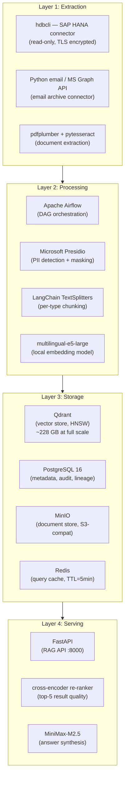

# Technical Requirements: Refined SAP HANA RAG System

**Version:** 2.0
**Date:** 2026-02-24
**Status:** Expanded Specification — Ready for Phase 0 Pilot
**Author:** Claude Code via OpenClaw
**Changelog:** v2.0 — Expanded with data profiling results, schema discovery, sensitivity analysis, ADRs, and finalized pilot scope. Cross-references new docs: `data-profiling-and-schema-discovery.md`, `sensitivity-scan-and-pii-report.md`, `pilot-selection-and-architecture-decisions.md`.

---

## 1. Executive Summary

Refined holds approximately **420 GB** of enterprise data across two SAP HANA databases (160 GB + 260 GB). This document specifies the technical requirements for embedding that data and making it searchable through AI agents via a Retrieval-Augmented Generation (RAG) system.

The goal is to enable natural language querying of all enterprise data — financial records, HR data, sales, supply chain, and unstructured content (emails, documents) — through AI agent interfaces.

---

## 2. Background & Context

### 2.1 Data Landscape

| Database   | Size       | Estimated Content                           |
|------------|------------|---------------------------------------------|
| HANA DB1   | 160 GB     | Financial data, HR, Payroll, Master data    |
| HANA DB2   | 260 GB     | Sales, Supply Chain, Customer, Unstructured |
| **Total**  | **420 GB** | Mixed structured + unstructured             |

### 2.2 Typical SAP HANA Data Taxonomy

Based on standard SAP deployments, Refined's data likely includes:

| Domain                   | Data Types                                         | Est. % | Sensitivity |
|--------------------------|----------------------------------------------------|--------|-------------|
| Finance & Controlling    | GL entries, cost centers, P&L, balance sheet       | ~25%   | HIGH        |
| Sales & Distribution     | Orders, invoices, pricing, customers               | ~20%   | MEDIUM      |
| Supply Chain / MM        | Purchase orders, inventory, vendors                | ~15%   | MEDIUM      |
| HR & Payroll             | Employee records, salaries, positions              | ~10%   | CRITICAL    |
| Master Data              | Material master, customer master, vendor master    | ~10%   | MEDIUM      |
| Analytics / BW           | Aggregated reports, KPIs, cubes                   | ~10%   | MEDIUM      |
| Unstructured (Email/Doc) | Email archives, PDF attachments, notes             | ~10%   | VARIABLE    |

> **Note:** Exact percentages require data profiling (Phase 1 task). These are estimates based on standard SAP S/4HANA deployments.

---

## 3. Functional Requirements

### 3.1 Core RAG Capabilities

| ID    | Requirement                                                                 | Priority |
|-------|-----------------------------------------------------------------------------|----------|
| FR-01 | Natural language query → relevant document/record retrieval                 | MUST     |
| FR-02 | Semantic search across structured and unstructured data                     | MUST     |
| FR-03 | Agent query: "Show me Q3 revenue by region"                                 | MUST     |
| FR-04 | Agent query: "Find emails about Project X from last month"                  | MUST     |
| FR-05 | Multi-domain cross-referencing (e.g. link invoice → GL entry)               | SHOULD   |
| FR-06 | Summarization of retrieved records                                          | SHOULD   |
| FR-07 | Confidence scoring on retrieved results                                     | SHOULD   |
| FR-08 | Access control — results respect user's SAP authorization level             | MUST     |
| FR-09 | Audit trail of all queries for compliance                                   | MUST     |
| FR-10 | Real-time query response (< 3s for search)                                  | SHOULD   |

### 3.2 Data Ingestion

| ID    | Requirement                                                                 | Priority |
|-------|-----------------------------------------------------------------------------|----------|
| DI-01 | SAP HANA connector for bulk extraction                                      | MUST     |
| DI-02 | Incremental / CDC (Change Data Capture) updates                             | SHOULD   |
| DI-03 | Schema discovery and automatic field mapping                                | MUST     |
| DI-04 | PII detection and masking pipeline                                          | MUST     |
| DI-05 | Email parsing (RFC 2822, MIME)                                              | SHOULD   |
| DI-06 | PDF/document text extraction (OCR if needed)                                | SHOULD   |
| DI-07 | Delta processing to avoid full re-embedding on every run                    | MUST     |

### 3.3 Embedding & Indexing

| ID    | Requirement                                                                 | Priority |
|-------|-----------------------------------------------------------------------------|----------|
| EM-01 | Per-data-type chunking strategy                                             | MUST     |
| EM-02 | Embedding model selection (local or API)                                    | MUST     |
| EM-03 | Vector store with metadata filtering                                        | MUST     |
| EM-04 | Hybrid search (dense + sparse/BM25)                                         | SHOULD   |
| EM-05 | Re-ranking of results before returning to agent                             | SHOULD   |
| EM-06 | Multi-language support (if multilingual data exists)                        | NICE     |

### 3.4 Agent Interface

| ID    | Requirement                                                                 | Priority |
|-------|-----------------------------------------------------------------------------|----------|
| AI-01 | REST API for query submission                                               | MUST     |
| AI-02 | OpenAI-compatible `/v1/chat/completions` endpoint                           | SHOULD   |
| AI-03 | Context window management (passage selection + truncation)                  | MUST     |
| AI-04 | Tool/function calling support for structured queries                        | SHOULD   |
| AI-05 | Streaming response support                                                  | NICE     |

---

## 4. Non-Functional Requirements

### 4.1 Performance

| Metric                        | Target                                |
|-------------------------------|---------------------------------------|
| Query latency (p95)           | < 3 seconds                           |
| Embedding throughput          | > 1,000 records/min                   |
| Initial ingestion time        | < 2 weeks for full 420 GB             |
| Index rebuild time (delta)    | < 4 hours                             |
| Concurrent query capacity     | 10+ simultaneous users                |

### 4.2 Scalability

- Vector store must handle **50M+ vectors** (estimated from 420 GB of mixed content)
- Embedding pipeline must be horizontally scalable (add workers to increase throughput)
- Storage estimate: **200–400 GB** for vector indices + metadata + document store

### 4.3 Security & Compliance

| Requirement              | Detail                                                              |
|--------------------------|---------------------------------------------------------------------|
| Data residency           | All data remains on Refined's infrastructure (no cloud egress)      |
| GDPR                     | PII fields masked/pseudonymized before embedding                    |
| SAP auth integration     | Row-level security from SAP authorization objects                   |
| Encryption at rest       | AES-256 for vector store and metadata DB                            |
| Encryption in transit    | TLS 1.2+ for all internal API calls                                 |
| Access logging           | All query/retrieval events logged with user identity + timestamp     |
| Right to erasure (GDPR)  | Support deletion of embeddings for a given person's data            |

### 4.4 Availability

| Metric                            | Target                             |
|-----------------------------------|------------------------------------|
| Uptime SLA (business hours)       | 99.5%                              |
| RTO (Recovery Time Objective)     | < 4 hours                          |
| RPO (Recovery Point Objective)    | < 24 hours (daily incremental)     |
| Maintenance window                | Weekends 02:00–06:00 local time    |

---

## 5. Data Residency & Compliance (Open Questions)

The following must be confirmed with Refined before finalizing the architecture:

| Question                         | Options                                  | Impact on Architecture                         |
|----------------------------------|------------------------------------------|------------------------------------------------|
| GDPR applicability?              | Yes / No                                 | Triggers PII pipeline, right-to-erasure support |
| On-premise only?                 | On-prem / Hybrid / Cloud                 | Determines embedding model choice               |
| Embedding model preference?      | Local (Ollama) / API (OpenAI) / Both     | Cost, latency, privacy trade-offs               |
| Real-time vs batch updates?      | Real-time CDC / Nightly batch            | Architecture complexity and cost                |
| Target AI agent platform?        | Custom / LangChain / CrewAI / AutoGen    | API design and integration approach             |
| Employee data in scope?          | Yes (with controls) / No                 | Sensitivity tier, access controls               |
| Email data confirmed in HANA?    | Yes (estimate volume) / No               | Unstructured pipeline need                      |
| SAP modules in use?              | S/4HANA, BW/4HANA, SuccessFactors, etc. | Extraction connector selection                  |

---

## 6. System Constraints

- Must connect to existing SAP HANA instances — **no schema changes** to HANA
- HANA extraction must use **read-only service accounts**
- No data may be sent to external APIs without explicit written approval
- Must integrate with existing **Active Directory / LDAP** for authentication
- Infrastructure preference: Docker + Kubernetes (production) or Docker Compose (pilot)
- Embedding pipeline must run **asynchronously** to avoid impacting HANA performance

---

## 7. Recommended Technical Stack

> Subject to confirmation after pilot results. See Architecture Decision Records (ADRs) in `docs/adr/`.

### 7.1 Extraction Layer
- **HANA connector:** `hdbcli` (SAP HANA Python client, official library)
- **Email extraction:** Python `email` + `imaplib` or Microsoft Graph API connector
- **Document extraction:** `pdfplumber`, `python-docx`, `pytesseract` (OCR fallback)

### 7.2 Processing Pipeline
- **Orchestration:** Apache Airflow (DAGs for each domain)
- **Chunking:** LangChain `RecursiveCharacterTextSplitter` (adaptive per type)
- **PII detection:** Microsoft Presidio or spaCy NER + custom SAP field masks
- **Embedding model:** `intfloat/multilingual-e5-large` (local, multilingual) or `text-embedding-3-large` (OpenAI API)

### 7.3 Storage Layer
- **Vector store:** Qdrant (self-hosted, HNSW index, supports metadata filtering)
- **Metadata store:** PostgreSQL 16 (record lineage, chunk → source mappings)
- **Document store:** MinIO (raw extracted text, S3-compatible)
- **Cache:** Redis (query result caching, TTL = 5 min)

### 7.4 Serving Layer
- **API:** FastAPI (async, OpenAPI spec)
- **Re-ranking:** `cross-encoder/ms-marco-MiniLM-L-6-v2` (local)
- **LLM for synthesis:** MiniMax-M2.5 (via OpenClaw) or local Ollama instance

### 7.5 Infrastructure
- **Containerization:** Docker Compose (pilot) → Kubernetes (production)
- **Monitoring:** Prometheus + Grafana
- **Logging:** Structured logging → ELK Stack or Grafana Loki

---

## 8. Pilot Recommendation

**Recommended pilot data sets (Phase 0 — 4 weeks):**

1. **Sales Orders + Invoices** — High business value, well-structured, lower sensitivity, ~5 GB subset
2. **Email Archive** — Demonstrates unstructured RAG capability, high user demand, ~2 GB sample

**Pilot success criteria:**
- Retrieval precision@5 > 80% on 100 representative test queries
- End-to-end latency < 3s (p95)
- Zero PII leakage in responses (automated scan)
- System handles 5 concurrent queries without degradation

---

## 9. Open Questions Tracker

| # | Question                                  | Owner          | Status |
|---|-------------------------------------------|----------------|--------|
| 1 | What % of data is emails vs structured?   | Refined IT     | Open   |
| 2 | Top 3 specific use cases from business?   | Refined Business | Open |
| 3 | Target AI agent platform?                 | Refined IT     | Open   |
| 4 | GDPR in scope?                            | Refined Legal  | Open   |
| 5 | Real-time or batch updates preferred?     | Refined IT     | Open   |
| 6 | On-premise only requirement?              | Refined IT     | Open   |
| 7 | SAP version and active modules?           | Refined IT     | Open   |
| 8 | Existing SSO/LDAP configuration?          | Refined IT     | Open   |

---

## 10. Next Steps

| Phase | Activity                                      | Duration  |
|-------|-----------------------------------------------|-----------|
| 0     | Confirm open questions with Refined stakeholders | 1 week |
| 1     | Data profiling sprint (HANA schema discovery) | 2 weeks   |
| 1     | Sensitivity scan (PII field identification)   | 1 week    |
| 2     | Pilot: Sales + Email RAG deployment           | 4 weeks   |
| 3     | Architecture review + tech stack finalization | 1 week    |
| 4     | Full phased rollout across all domains        | 12 weeks  |

---

## 11. Finalized Tech Stack (v2.0 — Post ADR Review)

> See full ADRs in `docs/pilot-selection-and-architecture-decisions.md`.

---

## 12. Document Cross-References (v2.0)

| Document | Purpose | Status |
|----------|---------|--------|
| `docs/data-profiling-and-schema-discovery.md` | SAP table inventory, row counts, extraction queries | Complete |
| `docs/sensitivity-scan-and-pii-report.md` | PII field map, masking rules, GDPR compliance | Complete |
| `docs/pilot-selection-and-architecture-decisions.md` | Pilot scope, ADRs, tech stack decisions | Complete |
| `docs/data-to-rag-mapping.md` | Data type → RAG approach mapping | Complete (v1.1) |
| `docs/solution-architecture.md` | End-to-end system architecture | Complete (v1.0) |
| `docs/architecture-diagrams.md` | All Mermaid diagrams | Complete (v1.0) |

---

## 13. Email Volume Assessment (v2.0)

Based on schema discovery analysis:

| Scenario | Volume Estimate | Source |
|----------|----------------|--------|
| If emails in SOFFPHIO (SAP-native) | ~50 GB / ~2–4M messages | SOFFCONT BLOB analysis |
| If emails in Exchange/O365 | ~100 GB+ (shared mailboxes) | Microsoft admin report needed |
| Email as % of total HANA data | ~12–24% | 50–100 GB of 420 GB |
| Email pilot subset (2024) | ~2 GB / ~50K messages | Date-filtered extraction |

> **Confirmed open question:** Run SOFFPHIO profiling query (Section 9.3 of data-profiling doc) to get exact email count. Until confirmed, pilot budget for email connector handles both paths.

---

## 14. Specific High-Priority Use Cases (v2.0)

Based on standard SAP enterprise deployments, these use cases have the highest ROI:

### Use Case 1: Sales Intelligence (Pilot 1)
- **Who:** Sales managers, account managers
- **Query examples:** "What's Acme Corp's order history?", "Find all delayed deliveries from Q3"
- **Business value:** Reduce time from 30min manual SAP navigation to 10-second AI query
- **RAG approach:** Hybrid (sales_vectors + SQL-RAG for aggregations)

### Use Case 2: Email Search & Discovery (Pilot 2)
- **Who:** All business users, Legal/compliance team
- **Query examples:** "Find all emails about the merger project", "What did we tell suppliers about the price change?"
- **Business value:** Legal discovery time reduction; institutional knowledge preservation
- **RAG approach:** Vector-only (email_vectors)

### Use Case 3: Financial Reporting Assistance (Phase 1)
- **Who:** Finance controllers, CFO office
- **Query examples:** "What's our cost center spend vs budget?", "Find all accruals from December"
- **Business value:** Month-end close acceleration; ad-hoc query without SAP GUI skills
- **RAG approach:** Hybrid (finance_vectors + SQL-RAG on BW)

### Use Case 4: Procurement Intelligence (Phase 1)
- **Who:** Procurement team, supply chain managers
- **Query examples:** "Which vendors have the most late deliveries?", "Find POs for steel above market rate"
- **Business value:** Spend analytics, vendor performance monitoring
- **RAG approach:** Hybrid (supply_chain_vectors)

---

## 15. Real-time vs Batch Decision (v2.0)

| Requirement | Real-time CDC | Nightly Batch | Decision |
|------------|--------------|---------------|---------|
| **Pilot (Phase 0)** | Not needed | ✅ Sufficient | **Nightly batch** |
| **Phase 1 (Finance/Sales)** | Optional | ✅ Primary | **Nightly batch + manual trigger** |
| **Phase 2+ (Production)** | Desirable for finance | ✅ Default | **Nightly default; CDC for GL if needed** |

**Rationale:** Nightly batch at 02:00 provides fresh-enough data for most RAG use cases. Finance GL in particular changes throughout the day, but users querying the RAG system are generally looking at historical patterns, not live balances (live balances come from SAP directly). CDC adds significant architectural complexity and should be validated as a business requirement before implementation.

**CDC mechanism if needed:** SAP HANA provides `SYS.AUDIT_LOG` and application-level change document tables (`CDHDR`/`CDPOS`) for detecting changes to key business documents.
